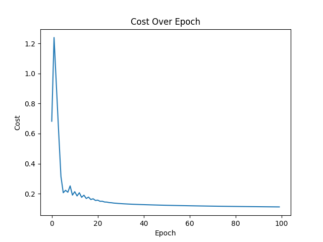
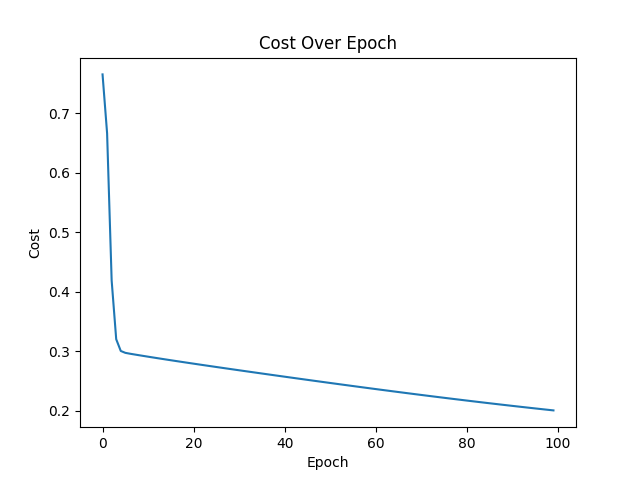
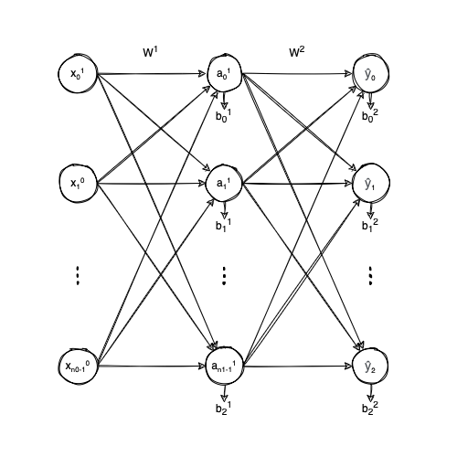
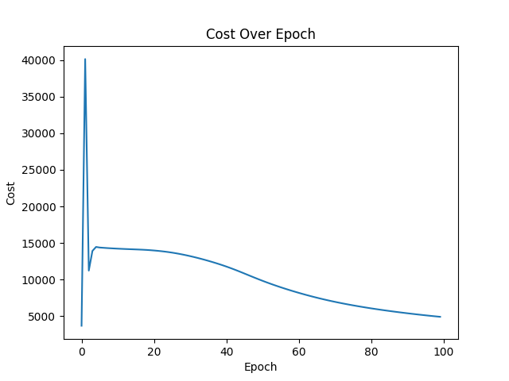

# Implementing a Neural Network from scratch - DLCV — Bastien Soucasse

All the methods have been configured similarly. The learning rate is set to 1, the number of epochs is set to 100, and the initial weights and bias are set by a random generator.

## Single neuron and binary classification

The accuracy of the single neuron for binary classification is **96.61%**.

Here, the loss curve is going up and down while descending. That is because the learning rate is a bit high for this method and the minimum is always stepped over. With a learning rate of 0.5, the curve is smoother.

## Hidden layer and binary classification

The accuracy of the neural network with a hidden layer of 64 units and a single output unit, is **91.12%**.

Now, this neural network is slightly less performant but still learns from the dataset. With better hyper-parameters it might learn much better.

## Hidden layer and multiclass classification

Architechture of the final neural network

The accuracy of the neural network with a hidden layer of 64 units and 10 output units, is **82.49%**.

Finally, the neural network that recognizes all digits is again a bit less efficient since it has to recognize different digits with different probabilities and not only if it's a 5 or not.
