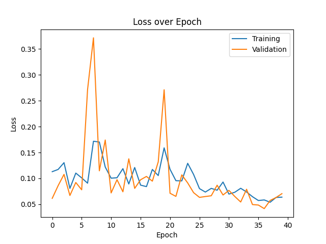
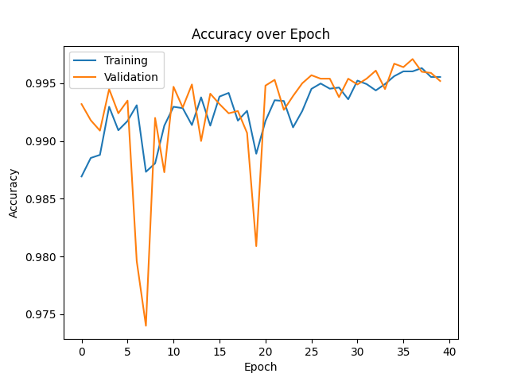
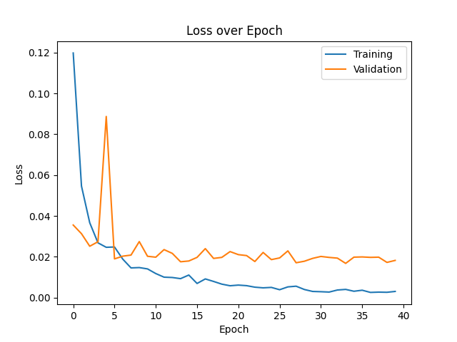
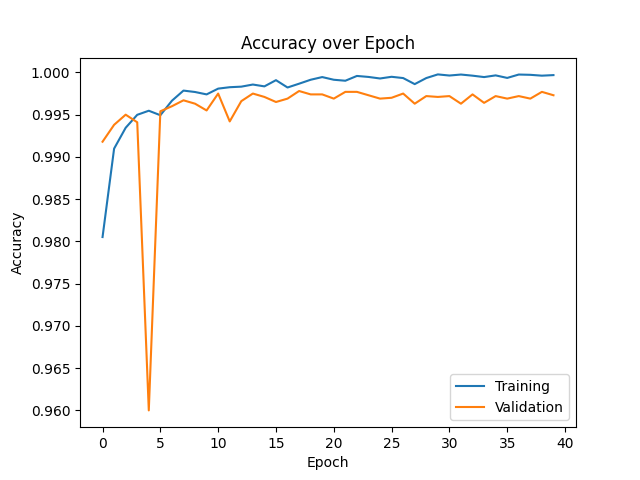

# DLCV - Soucasse Bastien - Provost Iantsa - Lab3

## 1. Single Neuron

### 1.2. Default Batch Size

|  Type  | Batch Size | Activation | Optimizer | Loss  | Accuracy |   Time   |
| :----: | :--------: | :--------: | :-------: | :---: | :------: | :------: |
| Binary |     32     |  Sigmoid   |   Adam    | 0.03  |  99.15%  |  XX.XXs  |

After 40 epochs, the loss and accuracy tends to stabilize and going further wouldn't be useful.

### 1.3. Different Batch Sizes

Now, let's study the batch size impact on the training of our model. The same model will run for the batch sizes 60000, 2048, 1024, 512, 256, 128, 64, 32, 16, and 8. The following figures show the model loss, accuracy, and duration, for each batch size.

We can see that smaller batch sizes give better results but take much longer. A good compromise would be around 32, as the results are nearly the same as smaller values, but the execution time remains acceptable. We will keep this one for our next models.

## 2. A Neural Network with One Hidden Layer

### 2.2. Default Network

|  Type  | HL Units |   Activations    | Optimizer | Loss  | Accuracy |   Time   | 
| :----: | :------: | :--------------: | :-------: | :---: | :------: | :------: |
| Binary |    64    | Sigmoid, Sigmoid |   Adam    | 0.02  |  99.77%  |  XX.XXs  |

<!-- real loss: 0.0185 -->
…

### 2.3. Different numbers of neurons on hidden layer

|  Type  | HL Units |   Activations    | Optimizer | Loss  | Accuracy |   Time   |
| :----: | :------: | :--------------: | :-------: | :---: | :------: | :------: |
| Binary |     8    | Sigmoid, Sigmoid |   Adam    | 0.02  |  99.58%  |  XX.XXs  |
| Binary |    16    | Sigmoid, Sigmoid |   Adam    | 0.02  |  99.72%  |  XX.XXs  |
| Binary |    32    | Sigmoid, Sigmoid |   Adam    | 0.02  |  99.75%  |  XX.XXs  |
| Binary |   128    | Sigmoid, Sigmoid |   Adam    | 0.01  |  99.80%  |  XX.XXs  |

**32 neurons**

<!-- real loss: 0.0167 -->
We get the same loss and accuracy than with 64 neurons. But is it faster ? To determine... 
Either way, let's try with 16 neurons to see if the performances are still ok.

**16 neurons**

<!-- real loss: 0.0176 -->
Again, we get really close results on loss and accuracy. We could try even less neurons out of curiosity.

**8 neurons**

<!-- real loss: 0.0171 -->
This time, the accuracy decreased a little bit more, more precisely by about 0.10%. However, the accuracy is still pretty high.

**128 neurons**

Since the accuracy is already very high, it would be overkilled to add more neurons to the hidden layer, at least for this model. Indeed, it would take more time (I guess ?), just to get just results that are just as good.

<!-- real loss: 0.0165 -->
That's the highest accuracy we got, but it's not significantly higher for us to say this model is the best one.

<!-- Maybe put this in the summary part ? -->
**Conclusion:** For this model, the number of neurons in the hidden layer is not a significant hyperparameter. As a consequence, we may chose the one that

### 2.4. Different activation functions

<!-- TODO: ALL RESULTS IN THIS SECTION ARE WEIRD -->

**N.B.:** We won't try softmax on last layer because it's only relevant on multiclass classification.

|  Type  | HL Units |   Activations    | Optimizer | Loss  | Accuracy |   Time   |
| :----: | :------: | :--------------: | :-------: | :---: | :------: | :------: |
| Binary |   64     |    relu, relu    |   Adam    |  0.07 |  99.52%  |  XX.XXs  |

<!-- real loss: 0.0705 -->
…

|  Type  | HL Units |   Activations    | Optimizer | Loss  | Accuracy |   Time   |
| :----: | :------: | :--------------: | :-------: | :---: | :------: | :------: |
| Binary |   64     |    tanh, tanh    |   Adam    | 0.02  |  99.73%  |  XX.XXs  |

<!-- real loss: 0.0182 -->
…

## 3. Multiclass Neural Networks

### 3.2. Default Network

|    Type    | HL Units |   Activations    | Optimizer | Loss  | Accuracy |   Time   |
|   :----:   | :------: | :--------------: | :-------: | :---: | :------: | :------: |
| Multiclass |    64    | sigmoid, softmax |   Adam    | 0.11  |  97.31%  |  XX.XXs  | <!-- real loss: 0.1117 -->

…

### 3.3. Different optimizers

|    Type    | HL Units |   Activations    | Optimizer | Loss  | Accuracy |   Time   |
|   :----:   | :------: | :--------------: | :-------: | :---: | :------: | :------: |
| Multiclass |    64    | sigmoid, softmax |   SGD     | 0.20  |  94.21%  |  XX.XXs  | <!-- real loss: 0.1971 -->
| Multiclass |    64    | sigmoid, softmax |  RMSprop  | 0.11  |  97.46%  |  XX.XXs  | <!-- real loss: 0.1087 -->

…

## 4. Best Network

<!-- TODO or not -->

### Summary table

<!-- TODO -->