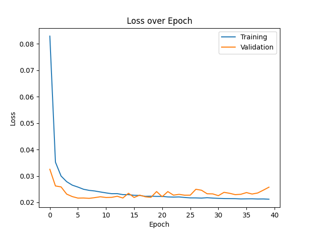
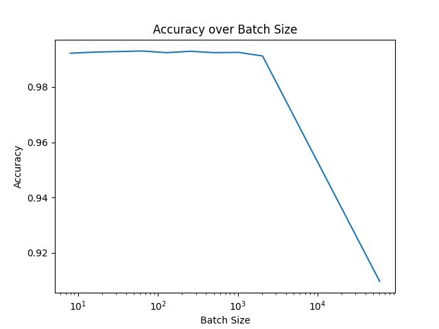
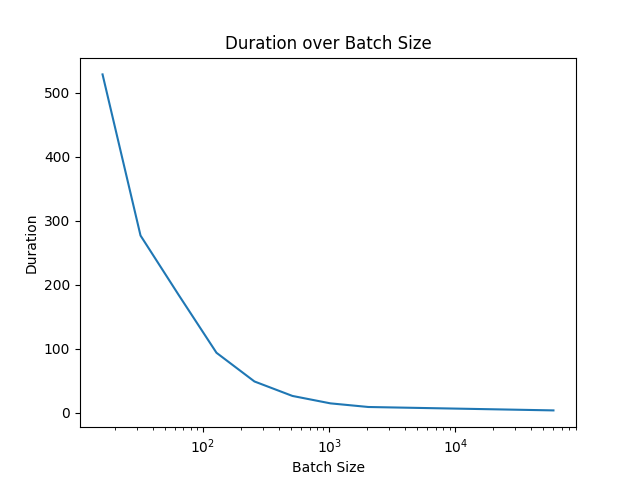

# DLCV - Soucasse Bastien - Provost Iantsa - Lab3

## 1. Single Neuron

### 1.2. Default Batch Size

|  Type  | Batch Size | Activation | Optimizer | Loss  | Accuracy |  Time  |
| :----: | :--------: | :--------: | :-------: | :---: | :------: | :----: |
| Binary |     32     |  Sigmoid   |   Adam    | 0.03  |  99.15%  | XX.XXs |

After 40 epochs, the loss and accuracy tends to stabilize and going further wouldn't be useful.

### 1.3. Different Batch Sizes

 |  Type  | Batch Size | Activation | Optimizer | Loss  | Accuracy |  Time  |
 | :----: | :--------: | :--------: | :-------: | :---: | :------: | :----: |
 | Binary |   60000    |  Sigmoid   |   Adam    | X.XX  |  XX.XX%  | XX.XXs |
 | Binary |    2048    |  Sigmoid   |   Adam    | X.XX  |  XX.XX%  | XX.XXs |
 | Binary |    1024    |  Sigmoid   |   Adam    | X.XX  |  XX.XX%  | XX.XXs |
 | Binary |    512     |  Sigmoid   |   Adam    | X.XX  |  XX.XX%  | XX.XXs |
 | Binary |    256     |  Sigmoid   |   Adam    | X.XX  |  XX.XX%  | XX.XXs |
 | Binary |    128     |  Sigmoid   |   Adam    | X.XX  |  XX.XX%  | XX.XXs |
 | Binary |     64     |  Sigmoid   |   Adam    | X.XX  |  XX.XX%  | XX.XXs |
 | Binary |     32     |  Sigmoid   |   Adam    | X.XX  |  XX.XX%  | XX.XXs |
 | Binary |     16     |  Sigmoid   |   Adam    | X.XX  |  XX.XX%  | XX.XXs |

We can see that smaller batch sizes give better results but take much longer. A good compromise would be around 32, as the results are nearly the same as smaller values, but the execution time remains acceptable. We will keep this one for our next models.

## 2. A Neural Network with One Hidden Layer

### 2.2. Default Network

|  Type  | HL Units |   Activations    | Optimizer | Loss  | Accuracy |  Time  |
| :----: | :------: | :--------------: | :-------: | :---: | :------: | :----: |
| Binary |    64    | Sigmoid, Sigmoid |   Adam    | 0.02  |  99.77%  | XX.XXs |

…

### 2.3. Different numbers of neurons on hidden layer

|  Type  | HL Units |   Activations    | Optimizer | Loss  | Accuracy |  Time  |
| :----: | :------: | :--------------: | :-------: | :---: | :------: | :----: |
| Binary |    8     | Sigmoid, Sigmoid |   Adam    | 0.02  |  99.58%  | XX.XXs |
| Binary |    16    | Sigmoid, Sigmoid |   Adam    | 0.02  |  99.72%  | XX.XXs |
| Binary |    32    | Sigmoid, Sigmoid |   Adam    | 0.02  |  99.75%  | XX.XXs |
| Binary |   128    | Sigmoid, Sigmoid |   Adam    | 0.01  |  99.80%  | XX.XXs |

**128 neurons**: Since the accuracy is already very high, it would be overkilled to add more neurons to the hidden layer, at least for this model. Indeed, it would take more time (I guess ?), just to get just results that are just as good.

That's the highest accuracy we got, but it's not significantly higher for us to say this model is the best one.

**Conclusion:** For this model, the number of neurons in the hidden layer is not a significant hyperparameter. As a consequence, we may chose the one that takes less time.

### 2.4. Different activation functions

**N.B.:** We won't try softmax on last layer because it's only relevant on multiclass classification.

|  Type  | HL Units |  Activations  | Optimizer | Loss  | Accuracy |  Time  |
| :----: | :------: | :-----------: | :-------: | :---: | :------: | :----: |
| Binary |    64    | sigmoid, relu |   Adam    | 1.51  |  90.20%  | XX.XXs |
| Binary |    64    | sigmoid, tanh |   Adam    | 0.02  |  99.68%  | XX.XXs |
| Binary |    64    | relu, sigmoid |   Adam    | 0.02  |  99.81%  | XX.XXs |
| Binary |    64    |  relu, relu   |   Adam    | 1.51  |  90.20%  | XX.XXs |
| Binary |    64    |  relu, tanh   |   Adam    | 1.51  |  90.20%  | XX.XXs |
| Binary |    64    | tanh, sigmoid |   Adam    | 0.02  |  99.81%  | XX.XXs |
| Binary |    64    |  tanh, relu   |   Adam    | 1.51  |  90.20%  | XX.XXs |
| Binary |    64    |  tanh, tanh   |   Adam    | 0.03  |  99.58%  | XX.XXs |

…

## 3. Multiclass Neural Networks

### 3.2. Default Network

|    Type    | HL Units |   Activations    | Optimizer | Loss  | Accuracy |  Time  |
| :--------: | :------: | :--------------: | :-------: | :---: | :------: | :----: |
| Multiclass |    64    | sigmoid, softmax |   Adam    | 0.11  |  97.31%  | XX.XXs | <!-- real loss: 0.1117 --> |

…

### 3.3. Different optimizers

|    Type    | HL Units |   Activations    | Optimizer | Loss  | Accuracy |  Time  |
| :--------: | :------: | :--------------: | :-------: | :---: | :------: | :----: |
| Multiclass |    64    | sigmoid, softmax |    SGD    | 0.20  |  94.21%  | XX.XXs | <!-- real loss: 0.1971 --> |
| Multiclass |    64    | sigmoid, softmax |  RMSprop  | 0.11  |  97.46%  | XX.XXs | <!-- real loss: 0.1087 --> |

…

## 4. Best Network

<!-- TODO (or not) -->

### Summary table

## PYTORCH

### Binary Classification: Single Neuron

<!-- TODO -->

### Binary Classification: Hidden Layer

#### Hidden Layer Units (HLU)

|  Type  | HL Units |   Activations    | Optimizer |  Loss  | Accuracy |  Time   |
| :----: | :------: | :--------------: | :-------: | :----: | :------: | :-----: |
| Binary |    8     | Sigmoid, Sigmoid |   Adam    | 0.0091 |  99.75%  | 92.47s  |
| Binary |    16    | Sigmoid, Sigmoid |   Adam    | 0.0024 |  99.97%  | 96.81s  |
| Binary |    32    | Sigmoid, Sigmoid |   Adam    | 0.0002 | 100.00%  | 99.41s  |
| Binary |    64    | Sigmoid, Sigmoid |   Adam    | 0.0000 | 100.00%  | 102.66s |
| Binary |   128    | Sigmoid, Sigmoid |   Adam    | 0.0001 | 100.00%  | 119.12s |

…

#### Activation Functions (AF)

<!-- TODO -->

### Multiclass Classification

<!-- TODO -->
