# DLCV - Soucasse Bastien - Provost Iantsa - Lab3

## 1. Single Neuron

### 1.2. Default Batch Size

| Batch Size | Activation | Optimizer |  Loss  | Accuracy |  Time   |
| :--------: | :--------: | :-------: | :----: | :------: | :-----: |
|     32     |  Sigmoid   |   Adam    | 0.0232 |  99.31%  | 465.82s |

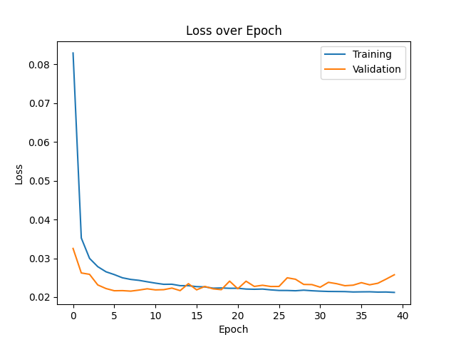
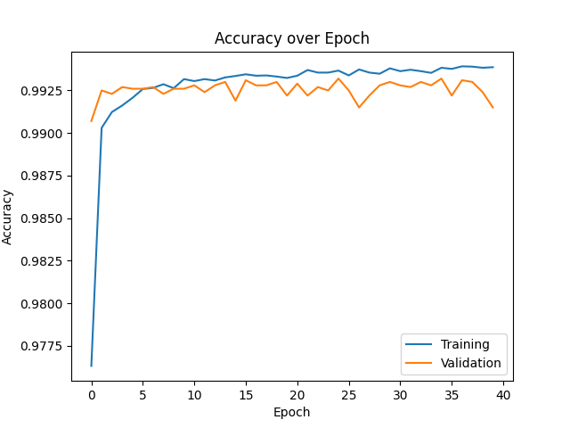

After 40 epochs, the loss and accuracy tends to stabilize and going further wouldn't be useful.

### 1.3. Different Batch Sizes

| Batch Size |  Loss  | Accuracy |  Time   |
| :--------: | :----: | :------: | :-----: |
|   60000    | 0.3035 |  90.20%  |  4.38s  |
|    2048    | 0.0333 |  99.08%  | 11.50s  |
|    1024    | 0.0244 |  99.25%  | 18.89s  |
|    512     | 0.0222 |  99.25%  | 33.66s  |
|    256     | 0.0214 |  99.30%  | 64.63s  |
|    128     | 0.0227 |  99.24%  | 147.17s |
|     64     | 0.0235 |  99.25%  | 291.96s |
|     32     | 0.0232 |  99.31%  | 465.82s |
|     16     | 0.0243 |  99.29%  | 565.27s |

<!-- 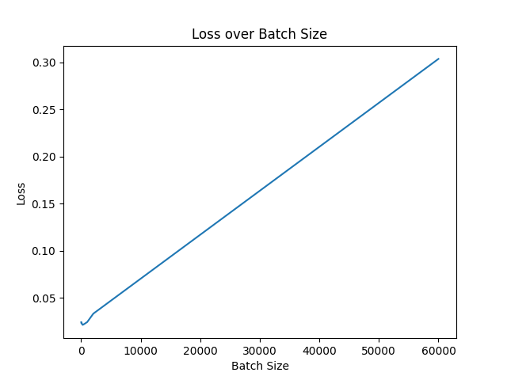 -->
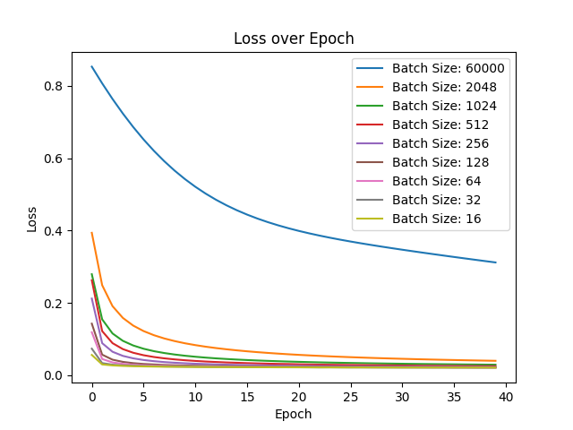
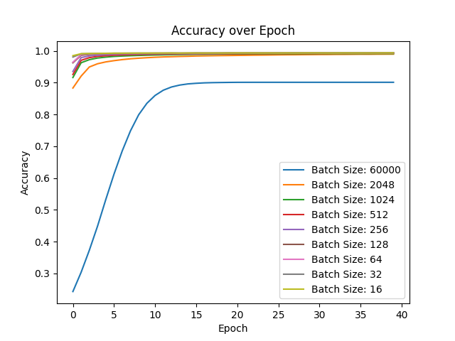
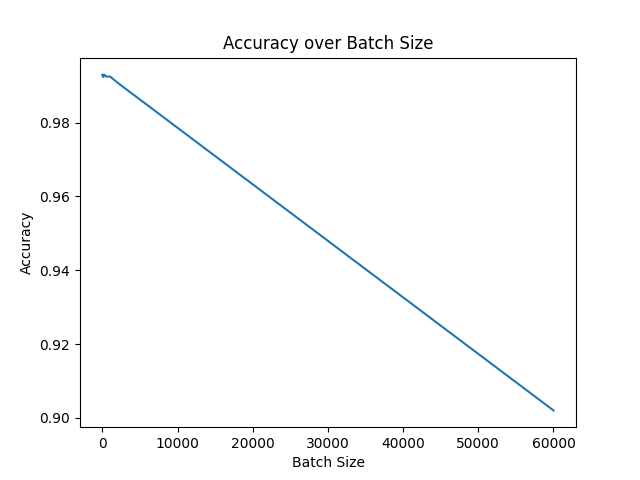
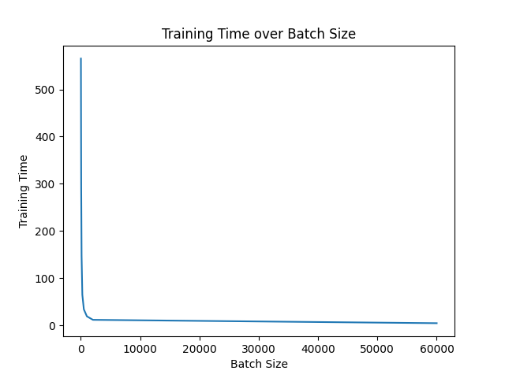

We can see that smaller batch sizes give better results but take much longer. A good compromise would be around 32, as the results are nearly the same as smaller values, but the execution time remains acceptable. We will keep this one for our next models.

## 2. A Neural Network with One Hidden Layer

### 2.2. Default Network

| HL Units |   Activations    | Optimizer | Loss  | Accuracy | Time  |
| :------: | :--------------: | :-------: | :---: | :------: | :---: |
|    64    | Sigmoid, Sigmoid |   Adam    | 0.02  |  99.77%  | 320s  |

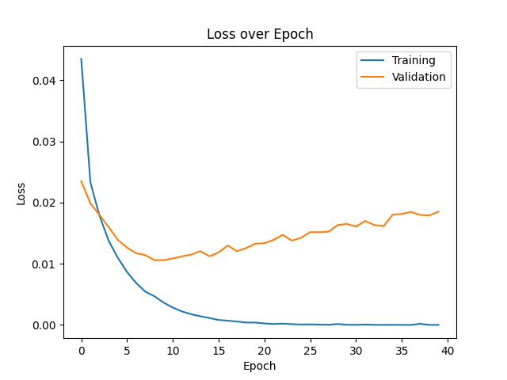
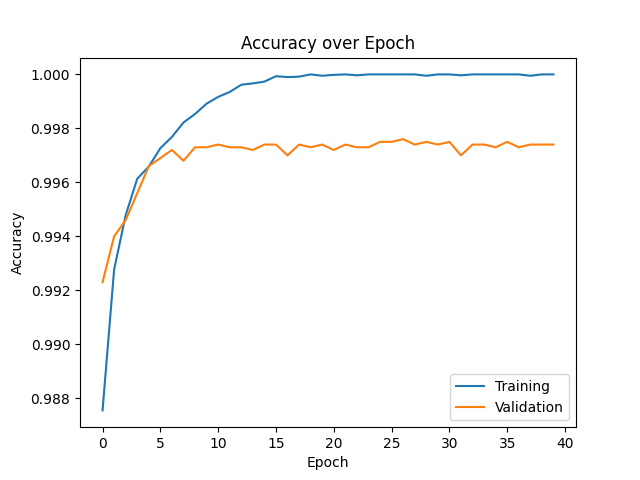

This first model provides more than acceptable results, with a 99.77% accuracy. Let's see how the number of neurons on the hidden layer, and the activation functions, affect its performance.

### 2.3. Different numbers of neurons on hidden layer

| HL Units | Loss  | Accuracy | Time  |
| :------: | :---: | :------: | :---: |
|    8     | 0.02  |  99.58%  | 326s  |
|    16    | 0.02  |  99.72%  | 322s  |
|    32    | 0.02  |  99.75%  | 318s  |
|    64    | 0.02  |  99.77%  | 320s  |
|   128    | 0.01  |  99.80%  | 322s  |

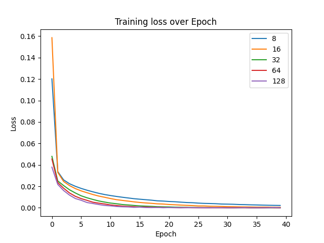
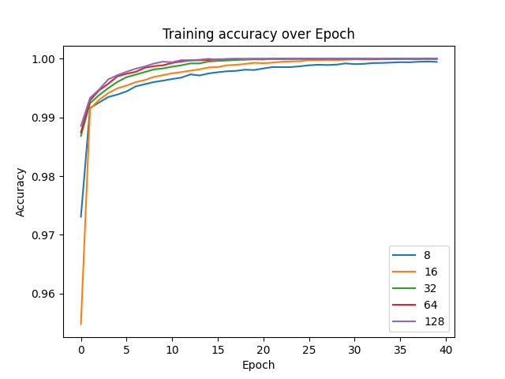

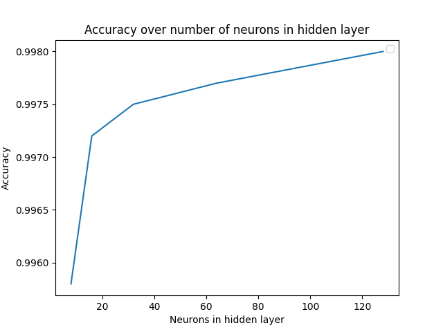

Looking at the accuracy plot, it appears that the more neurons on hidden layer, the better the model. But actually, the other plots and the table shows that the results are fairly similar, whether on loss, accuracy or time.

Indeed, the 128-unit model gives the highest accuracy, but it's not significantly higher than the other ones for us to say this model is THE best one.

**Conclusion:** For this model, the number of neurons in the hidden layer is not a significant hyperparameter. As a consequence, we may choose the one that gives the best accuracy (here the 128-unit one) since they all take a similar amount of time.

### 2.4. Different activation functions

*N.B.:* We won't try Softmax on last layer because it's only relevant on multiclass classification.

|   Activations    | Loss  | Accuracy | Time  |
| :--------------: | :---: | :------: | :---: |
| Sigmoid, Sigmoid | 0.02  |  99.77%  | 320s  |
|  Sigmoid, ReLU   | 1.51  |  90.20%  | 340s  |
|  Sigmoid, Tanh   | 0.02  |  99.68%  | 340s  |
|  ReLU, Sigmoid   | 0.02  |  99.81%  | 325s  |
|    ReLU, ReLU    | 1.51  |  90.20%  | 333s  |
|    ReLU, Tanh    | 1.51  |  90.20%  | 338s  |
|  Tanh, Sigmoid   | 0.02  |  99.81%  | 338s  |
|    Tanh, ReLU    | 1.51  |  90.20%  | 343s  |
|    Tanh, Tanh    | 0.03  |  99.58%  | 344s  |

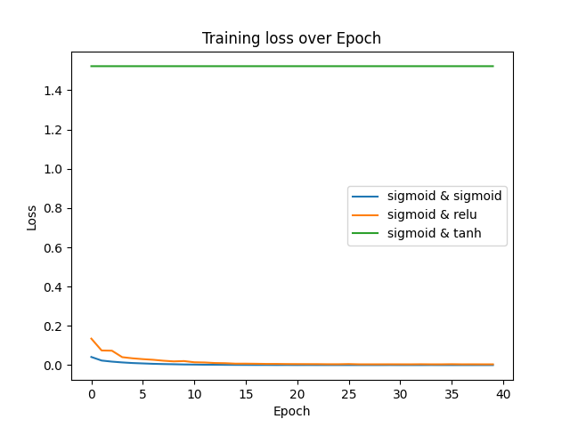
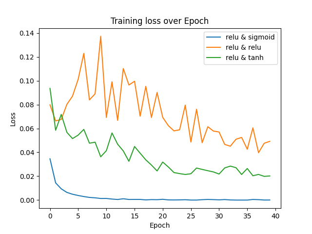
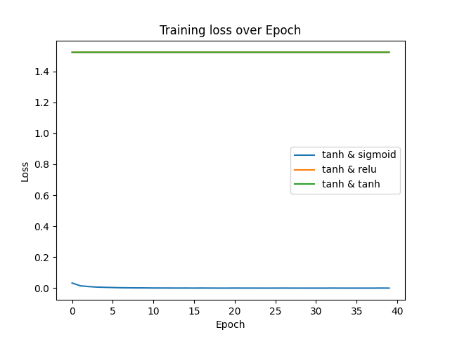

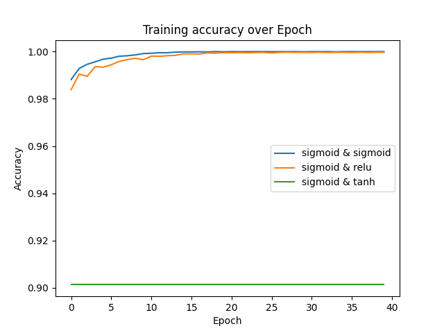
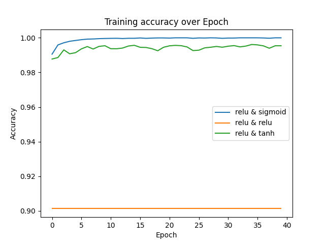
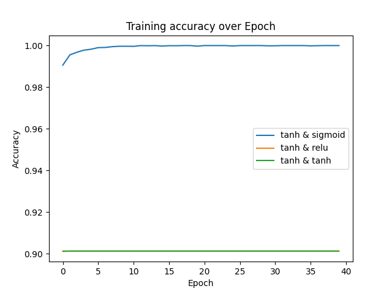

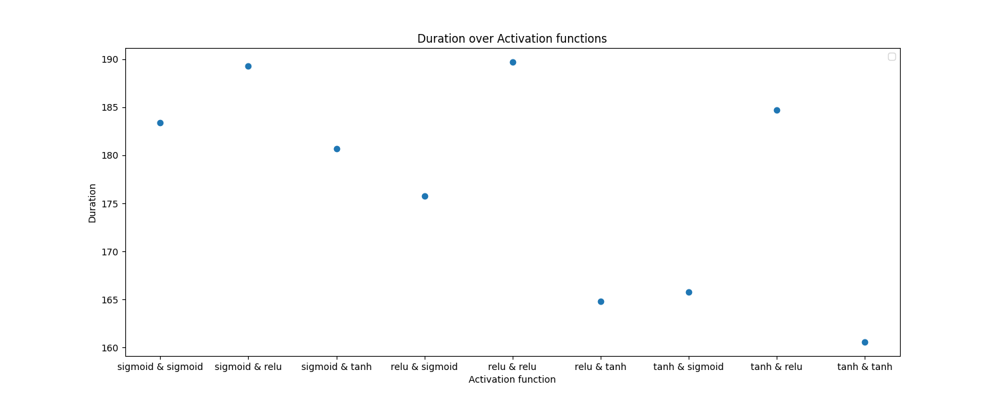

This time, we observe 2 categories. On one hand, models with an accuracy around 90%. On the other hand, models with one around 99%. Actually, the members of each category are not constant over the different executions, which makes it difficult to figure out.

**Conclusion:** A configuration that always gives good performances is the (sigmoid, sigmoid) one, that's why we should choose it, out of "security".

## 3. Multiclass Neural Networks

### 3.2. Default Network

| Optimizer |   Activations    |  Loss  | Accuracy |  Time  |
| :-------: | :--------------: | :----: | :------: | :----: |
|   Adam    | Sigmoid, Softmax | 0.1117 |  97.31%  | XX.XXs |

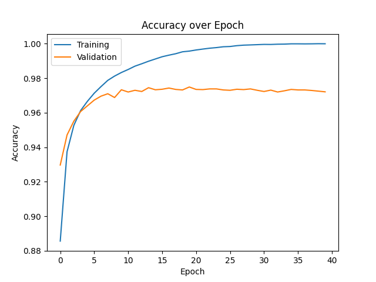

This first multiclass model provides very good results, with a 97.31% accuracy. Let's see how the different optimizers affect its performance.

### 3.3. Different optimizers

| Optimizer |  Loss  | Accuracy |  Time  |
| :-------: | :----: | :------: | :----: |
|   Adam    | 0.1117 |  97.31%  | XX.XXs |
|  RMSprop  | 0.1087 |  97.46%  | XX.XXs |
|    SGD    | 0.1971 |  94.21%  | XX.XXs |

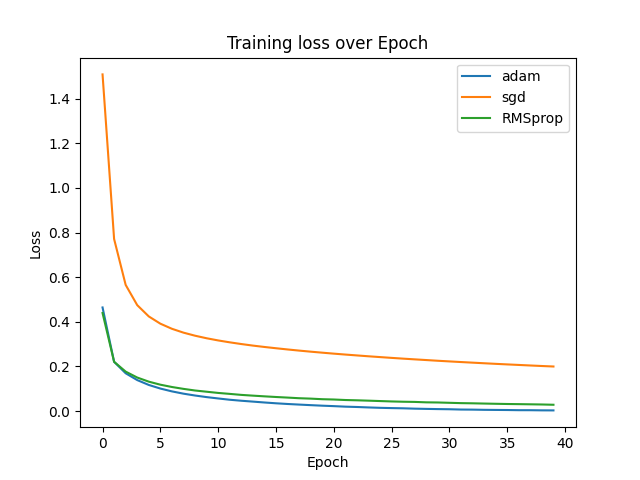
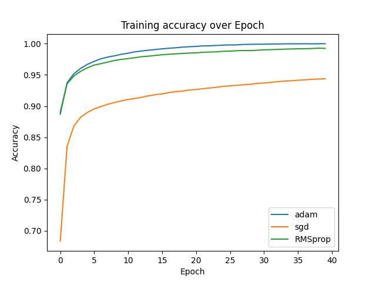
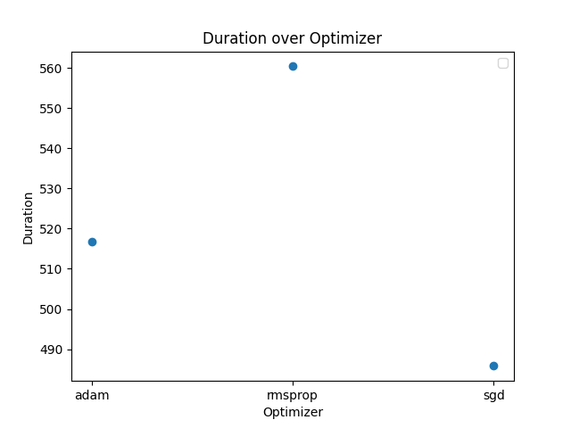

It is obvious that the SGD optimizer is beaten by the two others, in accuracy and time. Even though Adam and RMSProp have similar and high accuracies, RMSProp is about one minute shorter.

**Conclusion**: RMSProp is the best optimizer out of the three optimizers tested.

## 4. Best Network

After all the tests done in the previous section, let's gather the best hyperparameter to (hopefully) create the best model.

| Batch Size | HL Units |   Activations    | Optimizer |  Loss  | Accuracy |  Time   |
| :--------: | :------: | :--------------: | :-------: | :----: | :------: | :-----: |
|     32     |    128   | Sigmoid, Softmax |  RMSProp  | X.XXXX |  XX.XX%  | XXX.XXs |

### Summary table

## PyTorch

### Binary Classification: Single Neuron

| Batch Size |  Loss  | Accuracy |  Time   |
| :--------: | :----: | :------: | :-----: |
|   60000    | 0.3027 |  90.97%  | 123.33s |
|    2048    | 0.1008 |  94.53%  | 96.60s  |
|    1024    | 0.0904 |  96.59%  | 98.84s  |
|    512     | 0.0845 |  96.81%  | 100.26s |
|    256     | 0.0822 |  97.31%  | 101.05s |
|    128     | 0.0807 |  97.61%  | 105.33s |
|     64     | 0.0799 |  97.64%  | 112.18s |
|     32     | 0.0790 |  97.74%  | 121.56s |
|     16     | 0.0787 |  97.79%  | 142.27s |

<!-- 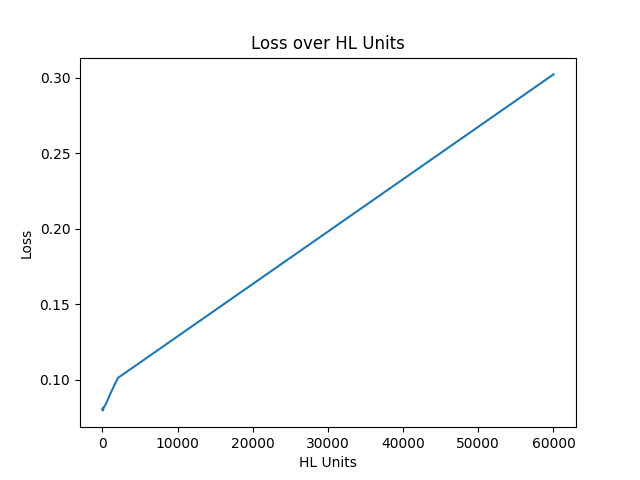 -->
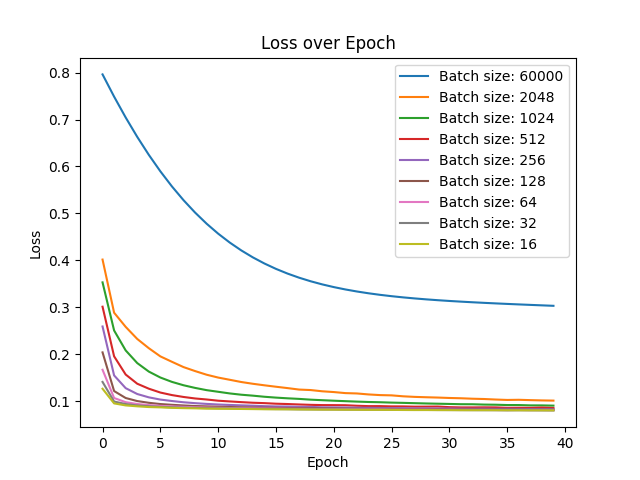
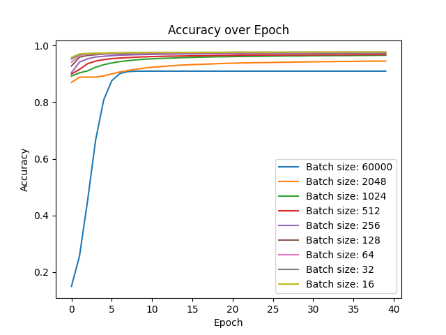
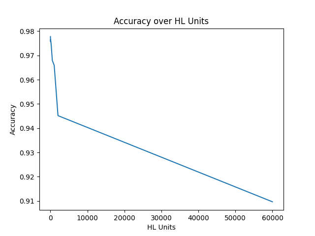
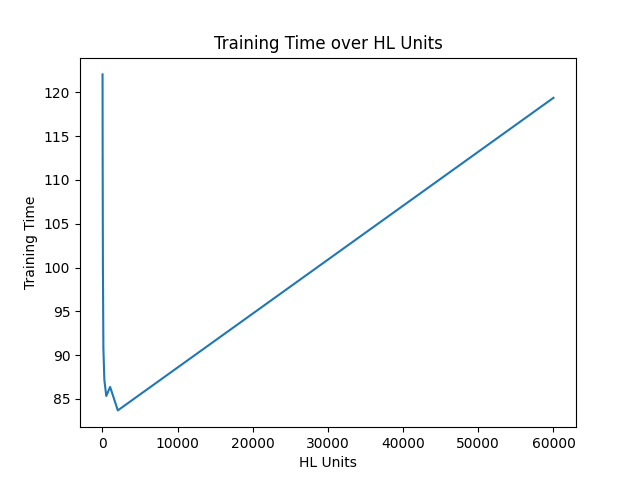

As we have seen before, the smaller the batch size, the better the accuracy. But the training time is also growing rapidly. So, in order to keep a good ratio time/effectiveness, a batch size of 32 still seems the better option.

### Binary Classification: Hidden Layer

#### Hidden Layer Units (HLU)

|  HLU  |  Loss  | Accuracy |  Time   |
| :---: | :----: | :------: | :-----: |
|   8   | 0.0091 |  99.75%  | 92.47s  |
|  16   | 0.0024 |  99.97%  | 96.81s  |
|  32   | 0.0002 | 100.00%  | 99.41s  |
|  64   | 0.0000 | 100.00%  | 102.66s |
|  128  | 0.0001 | 100.00%  | 119.12s |

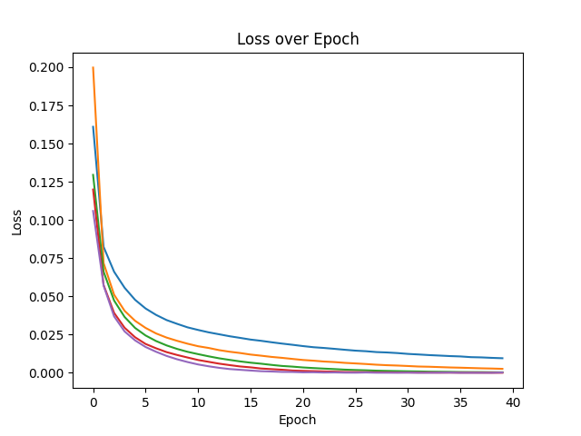
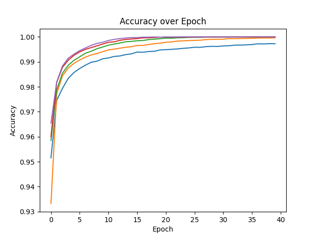
<!--  -->
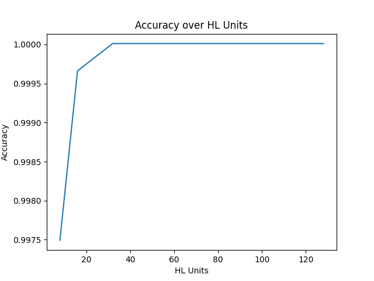
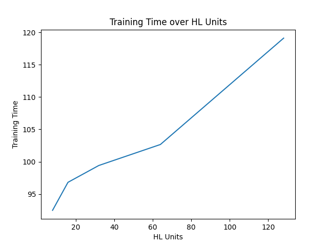

As expected, the more HLU, the better the accuracy. But the training time is also growing rapidly. So, in order to keep a good ratio time/effectiveness, 64 units still seems the better option.

#### Activation Functions (AF)

<!-- TODO -->

### Multiclass Classification

| Optimizer |  Loss  | Accuracy |  Time  |
| :-------: | :----: | :------: | :----: |
|   Adam    | 1.4708 |  99.12%  | 97.29s |
|  RMSprop  | 1.4701 |  99.16%  | 96.68s |
|    SGD    | 2.2037 |  23.30%  | 96.39s |

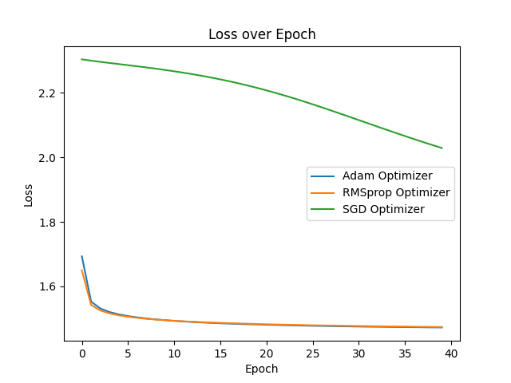
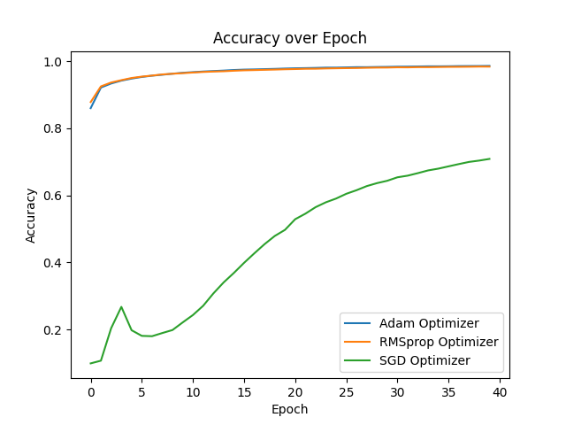
<!--  -->
<!-- 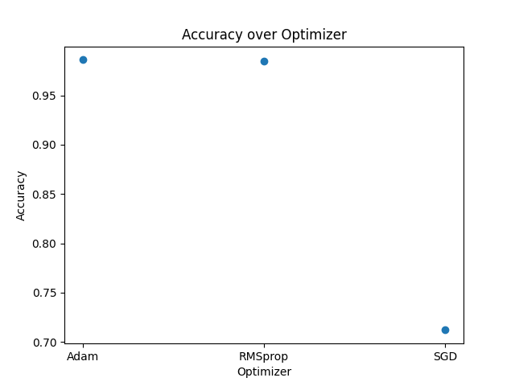 -->

We can notice that the SGD optimizer doesn't give results as good as the other two on this dataset. Adam and RMSprop are both giving the same results.
