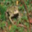

## 3. Data Augmentation

### Model Without Data Augmentation

We are now going to use a stable model based on `model5` that we previously saw, and matching the one we used on the Keras version.

#### Model Summary

|    ID     | Data Augmentation |  Loss  | Accuracy | Training Time |
| :-------: | :---------------: | :----: | :------: | :-----------: |
| PraisyNet |        No         | 1.1851 |  69.80%  |    160.63s    |

[architecture]

#### Loss and Accuracy Plots

As we have seen before with `model5`, there is a lot of overfitting here.

#### Confusion Matrix

The confusion matrix is good, confirming this is a good base model.

#### 10 Worst Classified Images

| Rank  | Image Idx. | Pred. Cat. | Act. Cat. |                                Image                                 |
| :---: | :--------: | :--------: | :-------: | :------------------------------------------------------------------: |
|  10   |    8981    |    Deer    |   Horse   |  |
|   9   |    9084    |    Cat     |    Dog    |   |
|   8   |    6814    |    Car     |   Truck   |   |
|   7   |    9461    |    Frog    |   Deer    |   |
|   6   |    7929    |    Bird    |   Plane   |   |
|   5   |    4032    |    Dog     |    Cat    |   |
|   4   |    2641    |    Frog    |   Deer    |   |
|   3   |    8187    |   Horse    |    Dog    |   |
|   2   |    1631    |   Truck    |    Car    |   |
|   1   |    8808    |    Cat     |   Frog    |   |

### Model With Data Augmentation

We are now going to use a stable model based on `model5` that we previously saw, and matching the one we used on the Keras version.

#### Model Summary

|    ID     | Data Augmentation |  Loss  | Accuracy |          Training Time          |
| :-------: | :---------------: | :----: | :------: | :-----------------------------: |
| PraisyNet |        Yes        | 0.7004 |  77.18%  | 899.34s (179.87s for 20 epochs) |

[architecture]

#### Loss and Accuracy Plots

There is clearly no overfitting anymore. The validation accuracy follows the training accuracy even up to 100 epochs.

#### Confusion Matrix

The confusion matrix is still good. So the results are not changed, the model only learns better.

#### 10 Worst Classified Images

| Rank  | Image Idx. | Pred. Cat. | Act. Cat. |                        Image                         |
| :---: | :--------: | :--------: | :-------: | :--------------------------------------------------: |
|  10   |    365     |   Plane    |   Deer    |  |
|   9   |    6901    |   Plane    |   Bird    |   |
|   8   |    8698    |    Deer    |   Frog    |   |
|   7   |    1118    |   Horse    |   Deer    |   |
|   6   |    8344    |    Deer    |   Horse   |   |
|   5   |    9132    |    Deer    |   Bird    |   |
|   4   |    453     |    Dog     |    Cat    |   |
|   3   |    115     |   Horse    |    Cat    |   |
|   2   |    6786    |    Dog     |    Cat    |   |
|   1   |    4571    |   Horse    |   Deer    |   |
