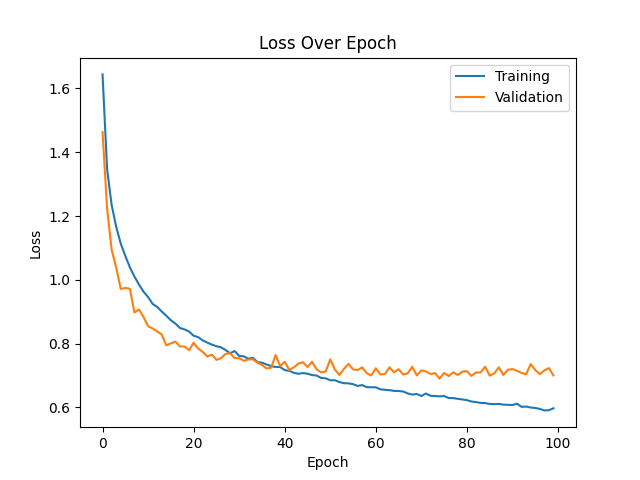
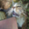
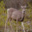

## 3. Data Augmentation

### Model Without Data Augmentation

We are now going to use a stable model based on `model5` that we previously saw, and matching the one we used on the Keras version.

#### Model Summary

|    ID     | Data Augmentation |  Loss  | Accuracy | Training Time |
| :-------: | :---------------: | :----: | :------: | :-----------: |
| PraisyNet |        No         | 1.1851 |  69.80%  |    160.63s    |

[architecture]

#### Loss and Accuracy Plots

As we have seen before with `model5`, there is a lot of overfitting here.

#### Confusion Matrix

The confusion matrix is good, confirming this is a good base model.

#### 10 Worst Classified Images

| Rank  | Image Idx. | Pred. Cat. | Act. Cat. |                                Image                                 |
| :---: | :--------: | :--------: | :-------: | :------------------------------------------------------------------: |
|  10   |    8981    |    Deer    |   Horse   |  |
|   9   |    9084    |    Cat     |    Dog    |   |
|   8   |    6814    |    Car     |   Truck   |   |
|   7   |    9461    |    Frog    |   Deer    |   |
|   6   |    7929    |    Bird    |   Plane   |   |
|   5   |    4032    |    Dog     |    Cat    |   |
|   4   |    2641    |    Frog    |   Deer    |   |
|   3   |    8187    |   Horse    |    Dog    |   |
|   2   |    1631    |   Truck    |    Car    |   |
|   1   |    8808    |    Cat     |   Frog    |   |

### Model With Data Augmentation

We are now going to use a stable model based on `model5` that we previously saw, and matching the one we used on the Keras version.

#### Model Summary

|    ID     | Data Augmentation |  Loss  | Accuracy |          Training Time          |
| :-------: | :---------------: | :----: | :------: | :-----------------------------: |
| PraisyNet |        Yes        | 0.7004 |  77.18%  | 899.34s (179.87s for 20 epochs) |

[architecture]

#### Loss and Accuracy Plots

There is clearly no overfitting anymore. The validation accuracy follows the training accuracy even up to 100 epochs.

#### Confusion Matrix

The confusion matrix is still good. So the results are not changed, the model only learns better.

#### 10 Worst Classified Images

| Rank  | Image Idx. | Pred. Cat. | Act. Cat. |                        Image                         |
| :---: | :--------: | :--------: | :-------: | :--------------------------------------------------: |
|  10   |    365     |   Plane    |   Deer    |  |
|   9   |    6901    |   Plane    |   Bird    |   |
|   8   |    8698    |    Deer    |   Frog    |   |
|   7   |    1118    |   Horse    |   Deer    |   |
|   6   |    8344    |    Deer    |   Horse   |   |
|   5   |    9132    |    Deer    |   Bird    |   |
|   4   |    453     |    Dog     |    Cat    |   |
|   3   |    115     |   Horse    |    Cat    |   |
|   2   |    6786    |    Dog     |    Cat    |   |
|   1   |    4571    |   Horse    |   Deer    |   |

  

## 4. Transfer learning / Fine-tuning on CIFAR10 dataset

For this part, we are going to use ResNet50 pre-trained on ImageNet. 
We want to specify our input shape and remove the classifier to add our own so the model can classify 10 classes.

#### Model Summaries

Now that we know data augmentation helps improve results, we want to try fine-tuning with and without data augmentation.

|     ID     | Data Augmentation |  Loss  | Accuracy | Training time |
| :--------: | :---------------: | :----: | :------: | :-----------: |
|  MyResNet  |        No         | 1.6432 |  82.43%  |   1076.82s    |
| MyResNetDA |        Yes        | 0.8252 |  80.67%  |   1079.93s    |

 

For both MyResnet and MyResNetDA, the accuracy has increased of more than 10% compared to PraisyNet (69.80%), which is a quite good improvement (even though the training time also increased). 

 

#### Loss, Accuracy Plots and Confusion Matrices

|     ID     |                            Loss Plot                             |                            Accuracy Plot                             |                               Confusion Matrix                               |
| :--------: | :--------------------------------------------------------------: | :------------------------------------------------------------------: | :--------------------------------------------------------------------------: |
|  MyResNet  |    |    |    |
| MyResNetDA |  |  |  |

 

Despite better accuracies in both models, their respective plots are questionable.
Indeed, for MyResNet, the accuracy and loss plots show overfitting around the third epoch.
Fortunately (or not), we can add data augmentation in order to solve our problem. The thing is, we now observe on the accuracy plot a train accuracy that is above the test accuracy. This is a sign of underfitting, due to data augmentation [TODO: add some details].

 

#### 10 Worst Classified Images

|       |  MyResNet  |            |           |                                                     | MyResNetDA |            |           |                                                       |
| :---: | :--------: | :--------: | :-------: | :-------------------------------------------------: | :--------: | :--------: | :-------: | :---------------------------------------------------: |
| Rank  | Image Idx. | Pred. Cat. | Act. Cat. |                        Image                        | Image Idx. | Pred. Cat. | Act. Cat. |                         Image                         |
|  10   |    8033    |    Dog     |    Cat    |  |    9336    |    Dog     |    Cat    |  |
|   9   |    9542    |   Truck    |    Car    |   |    3390    |    Dog     |    Cat    |   |
|   8   |    345     |    Cat     |    Dog    |   |    4248    |    Dog     |    Cat    |   |
|   7   |    1731    |    Cat     |    Dog    |   |    8069    |    Bird    |   Deer    |   |
|   6   |    4930    |   Truck    |    Car    |   |    6383    |    Dog     |    Cat    |   |
|   5   |    5598    |   Truck    |    Car    |   |    9406    |    Cat     |    Dog    |   |
|   4   |    8549    |   Truck    |    Car    |   |    5724    |    Cat     |    Dog    |   |
|   3   |    4206    |   Truck    |    Car    |   |    6174    |    Dog     |    Cat    |   |
|   2   |    601     |    Cat     |    Dog    |   |    5237    |    Bird    |   Deer    |   |
|   1   |    3067    |    Dog     |    Cat    |   |    6237    |    Dog     |    Cat    |   |

By analysing each ranking, we can observe that
- MyResNet gives the worst results when mistaking Car as Truck (5 times), Cat as Dog (2 times) and Dog as Cat (3 times)
- MyResNetDA gives the worst results when mistaking Cat as Dog (6 times) and Dog as Cat (2 times)

As mentionned earlier, since those classes are of "same type", the error is understandable.