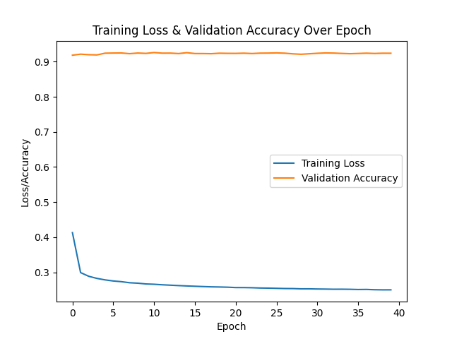
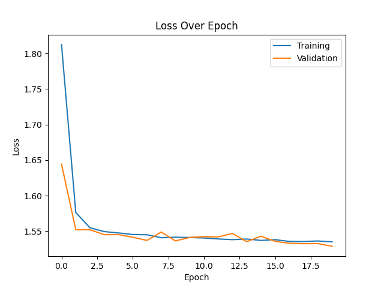
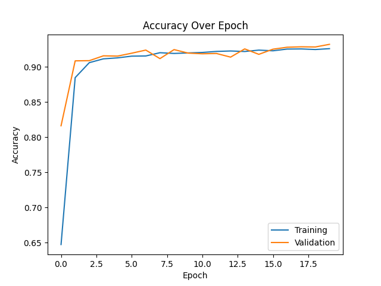
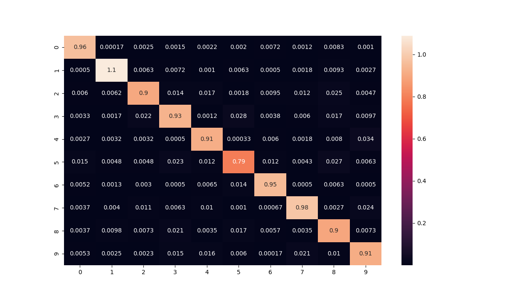

# PROVOST Iantsa & SOUCASSE Bastien — DLCV Lab 4

<!-- TODO: add machine -->

# Keras

## 1. Convolutional Neural Network on MNIST dataset

### 1.2. First CNN

*N.B.*: After running the program with 40 epochs and realizing it takes a lot of time, we decided to lower the number of epochs to 20. Indeed, the results seems to stabilize around that number.

#### Hyperparameters & Results

| Batch Size |  Filters |  Kernel Size  | Stride | Padding |   Loss  | Accuracy |   Time   |
| :--------: | :------: | :-----------: | :----: | :-----: | :-----: | :------: | :------: |
|     32     |    32    |    (3, 3)     |   1    | 'valid' |  0.3152 |  92.43%  |  622.84s |

<!-- temps abérant, à voir sur ton ordi -->
<!-- Results for double plots:
SUMMARY:
    - Loss: 0.3228
    - Accuracy: 0.9154
    - Training Time: 1343.11s

Results for two plots:
SUMMARY:
    - Loss: 0.3107
    - Accuracy: 0.9167
    - Training Time: 1282.95s -->

 

#### Loss and Accuracy Plot

 

#### Confusion matrix

 

<!-- TODO: Comment those results -->
…

 

#### 10 worst classified images

First of all, let's define what we mean by "badly classified" images. Here, we consider an image badly classified if:
- it is misclassified
- the probability predicted by the model that it's their actual category is low

As a consequence, we decided to gather all the misclassified images and selected the ones that had the ten lowest predicted probability for their actual class.

 

| Rank  | Image idx  | Pred. cat. | Act cat. |
| :---: | :--------: | :--------: | :------: |
|  10   |     X      |     X      |    X     |
|   9   |     X      |     X      |    X     |
|   8   |     X      |     X      |    X     |
|   7   |     X      |     X      |    X     |
|   6   |     X      |     X      |    X     |
|   5   |     X      |     X      |    X     |
|   4   |     X      |     X      |    X     |
|   3   |     X      |     X      |    X     |
|   2   |     X      |     X      |    X     |
|   1   |     X      |     X      |    X     |

 

### 1.3. Comparison

Here are the configuration and results of the best model we obtained on lab3.3.

|    Model    | Accuracy |   Time   |
| :---------: | :------: | :------: |
| best lab3.3 |  97.82%  | 561.08s  |
|  first CNN  |  92.43%  | 622.84s  |

<!-- temporary time, to update (also update sentence, as adapted) -->
The CNN model takes two times more time than the lab3.3 best model and provides a 5% lower accuracy. For now, the CNN model doesn't look good. It must be improvable.

 

### 1.4. Model improvment

…

  

## 2. Convolutional Neural Network on CIFAR10 dataset

## 3. Data augmentation

## 4. Transfer learning / fine-tuning on CIFAR10 dataset

# PyTorch

## 1. Convolutional Neural Network on MNIST dataset

### 1.2. First CNN

#### Hyperparameters & Results

| Batch Size | Filters | Kernel Size | Stride | Padding |  Loss  | Accuracy |  Time   |
| :--------: | :-----: | :---------: | :----: | :-----: | :----: | :------: | :-----: |
|     32     |   32    |      3      |   1    | 'valid' | 1.5289 |  93.21%  | 294.66s |

 

#### Loss and Accuracy Plots

On ne détecte bien aucun overfitting.

 

#### Confusion matrix

