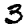
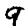
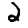
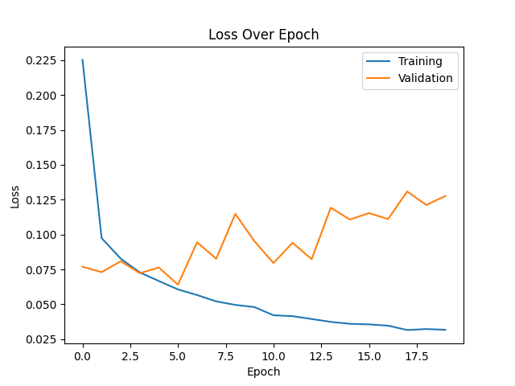
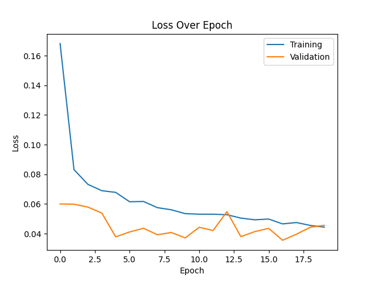
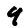
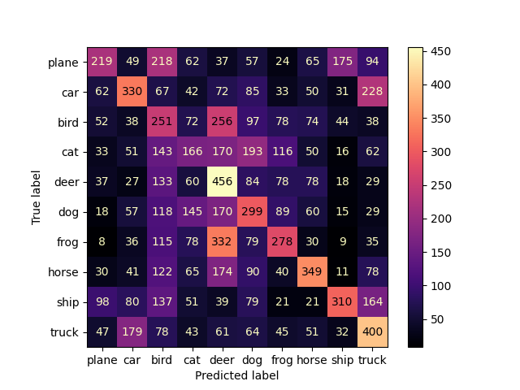
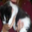

# PROVOST Iantsa & SOUCASSE Bastien — DLCV Lab 4

- Development
    - **Apple MacBook Air (2017)**
        - Intel Core i5 Chip: 1.8GHz dual-core Intel Core i5, Turbo Boost up to 2.9GHz, with 3MB shared L3 cache.
    - **Apple MacBook Air (2020)**
        - Apple M1 Chip: 8-core CPU with 4 perform­ance cores and 4 efficiency cores, 7-core GPU, and 16-core Neural Engine.
- Testing
    - **CREMI (vlaminck)**
        - 6-Core E-2236 32Go CPU, and RTX 2060 (6Go) GPU.

  

# Keras

## 1. Convolutional Neural Network on MNIST Dataset

### 1.2. First CNN

*N.B.:* After running the program with 40 epochs and realizing it takes a lot of time, we decided to lower the number of epochs to 20. Indeed, the results seems to stabilize around that number.

#### Model Summary

|   ID   |  Loss  | Accuracy | Training Time |
| :----: | :----: | :------: | :-----------: |
| model1 | 0.2940 |  91.96%  |    46.96s     |

- Convolution: 32, 3, 1, 'valid'.
- Flatten.
- Fully Connected: 10, 'softmax'.

 

#### Loss and Accuracy Plots

 

The plots for training data seem normal, but the validation data give don't follow: the model is overfitting. 

 

#### Confusion Matrix

 

The diagonal is where there are the higher numbers, which is a good thing since it represents the true positives. When it comes to misclassified images, we can observe that the most misclassified digits are:
- 5 as 3 (34)
- 8 as 5 (37)
- 9 as 4 (42)
- 9 as 7 (42)

 

#### 10 Worst Classified Images

First of all, let's define what we mean by "badly classified" images. Here, we consider an image badly classified if:
- it is misclassified
- the probability predicted by the model that it's their actual category is low

As a consequence, we decided to gather all the misclassified images and selected the ones that had the ten lowest predicted probability for their actual class.

 

| Rank  | Image idx | Pred. cat. | Act cat. |                      Image                      |
| :---: | :-------: | :--------: | :------: | :---------------------------------------------: |
|  10   |   1727    |     7      |    3     |  |
|   9   |   6511    |     5      |    3     |   |
|   8   |   4910    |     4      |    9     |   |
|   7   |    565    |     9      |    4     |   |
|   6   |   5874    |     3      |    5     |   |
|   5   |   7786    |     7      |    9     |   |
|   4   |   8297    |     5      |    8     |   |
|   3   |   7689    |     5      |    8     |   |
|   2   |   3862    |     3      |    2     |   |
|   1   |   2371    |     9      |    4     |   |

 

Note that this ranking is for an arbitrary run.

In this ranking, we can notice that there are the most confusions between:
- 5 and 3 (2)
- 5 and 8 (2)
- 4 and 9 (3)

Looking back at the confusion matrix, we can see that those 3 confusions all appear in the most misclassified digits list, at least in one way (the two ways being x misclassified as y, and y miscalssified as x).

 

### 1.3. Comparison

Here are the configuration and results of the best model we obtained on lab3.3.

|    Model    | Accuracy |  Time  |
| :---------: | :------: | :----: |
| best lab3.3 |  97.59%  | 42.64s |
|   model1    |  91.96%  | 46.96s |

The CNN model takes a little bit more time (5s) than the lab3.3 best model and provides an about 5% lower accuracy. For now, the CNN model is not better but it must be improvable.

 

### 1.4. Model Improvement

### 1.4.1. A new architecture

Let's use an architecture more complex given in class.

#### Model Summary

|   ID   |  Loss  | Accuracy | Training Time |
| :----: | :----: | :------: | :-----------: |
| model2 | 0.5195 |  97.81%  |    144.61s    |

- Convolution: 32, 3, 1, 'valid'.
- Convolution: 64, 3, 1, 'valid'.
- MaxPooling: 2, 1, 'valid'
- Convolution: 128, 3, 1, 'valid'.
- Flatten.
- Fully Connected: 10, 'softmax'.

This model's accuracy is much better, it even reaches the lab3.3 best model accuracy. However, the training time is way longer (about 3 times), but it remains reasonable.

 

#### Loss and Accuracy Plots

 

Our model is definitely **overfitting** but later than model1. Indeed, even though we got a very good accuracy and the training loss is decreasing as expected, the validation loss is increasing.

 

#### Confusion Matrix

 

Just like the first model, the diagonal is where there are the higher numbers. Moreover there are very few misclassified images (which is logical since the accuracy is higher). When it comes to misclassified images, we can observe that the most misclassified digits are:
- 6 as 0 (10)
- 8 as 7 (10)
- 5 as 3 (11) (also noticed in first model)
- 7 as 2 (12)
- 9 as 7 (19)

There are less misclassified images but more categories.

 

#### 10 Worst Classified Images

*N.B.*: To know what is meant by "10 worst classified images", see same section in **1.2**.

 

| Rank  | Image idx | Pred. cat. | Act cat. |                      Image                      |
| :---: | :-------: | :--------: | :------: | :---------------------------------------------: |
|  10   |   7813    |     8      |    9     |  |
|   9   |   2135    |     1      |    6     |   |
|   8   |   2298    |     0      |    8     |   |
|   7   |    290    |     5      |    8     |   |
|   6   |   5936    |     9      |    4     |   |
|   5   |   4838    |     5      |    6     |   |
|   4   |   9982    |     6      |    5     |   |
|   3   |   2770    |     7      |    3     |   |
|   2   |   7886    |     4      |    2     |   |
|   1   |   3794    |     3      |    8     |   |

 

First of all, none of the images in this ranking appear in the first model ranking.
Then, we can only observe 1 confusion in both ways between 5 and 6, which was not in the first model ranking. Also this confusion doesn't appear in the most misclassified images. But, they look "harder to recognize" (such as the 7th, 8th and 9th) than the ones in the first model.

 

### 1.4.2. Fighting against overfitting

This time, let's build a model with data normalization, to prevent overfitting. And then, try and improve its accuracy.

#### Models Summaries

Legend:
- Conv2D: nb_filters, kernel_size, stride, padding
- MaxPooling: pool_size, stride, padding

|   ID   | Architecture                                                                                                                                                                                         |  Loss  | Accuracy | Training time |
| :----: | :--------------------------------------------------------------------------------------------------------------------------------------------------------------------------------------------------- | :----: | :------: | :-----------: |
| model3 | - Conv2D: 32, `5`, 1, 'valid'   - Conv2D: 64, 5, 1, 'valid'   - `BatchNorm`   - MaxPooling: 2, 1, 'valid'   - Conv2D: 128, 5, 1, 'valid'   - Flatten   - Dense: 'softmax'          | 0.2406 |  98.12%  |    143.87s    |
| model4 | - Conv2D: 32, `5`, 1, 'valid'   - Conv2D: 64, 5, 1, 'valid'   - `BatchNorm`   - MaxPooling: 2, `2`, 'valid'   - Conv2D: 128, 5, 1, 'valid'   - Flatten   - Dense: 'softmax'        | 0.2260 |  98.13%  |    113.17s    |
| model5 | - Conv2D: `64`, `5`, 1, 'valid'   - Conv2D: `128`, 5, 1, 'valid'   - `BatchNorm`   - MaxPooling: 2, `2`, 'valid'   - Conv2D: `256`, 5, 1, 'valid'   - Flatten   - Dense: 'softmax' | 0.3216 |  98.04%  |    211.00s    |

Those 3 new models provide rather identical accuracies, that are slightly better than the model2 one. The training time allows to decide between them. Indeed, even if these information are not sufficient to choose a model, model4 seems to be the best model so far.

 

|   ID   |                         Loss Plot                          |                         Accuracy Plot                          |                            Confusion Matrix                            |
| :----: | :--------------------------------------------------------: | :------------------------------------------------------------: | :--------------------------------------------------------------------: |
| model3 |  |  |  |
| model4 |  |  |  |
| model5 |  |  |  |

Whether it is about loss or accuracy, for all 3 models, we can observe some overfitting since the training values are improving and not the validation ones.
Nevertheless, the scale is small so even if it may look huge, they actually all have:
- about 0.2-0.25 delta for the loss
- +/- 0.2 delta for the accuracy

They all look quite equivalent. More importantly, they show better results than model2. 

 

|       |  model3   |            |          |                                                 |  model4   |            |          |                                                 |  model5   |            |          |                                                 |
| :---: | :-------: | :--------: | :------: | :---------------------------------------------: | :-------: | :--------: | :------: | :---------------------------------------------: | :-------: | :--------: | :------: | :---------------------------------------------: |
| Rank  | Image idx | Pred. cat. | Act cat. |                      Image                      | Image idx | Pred. cat. | Act cat. |                      Image                      | Image idx | Pred. cat. | Act cat. |                      Image                      |
|  10   |   4196    |     9      |    5     |  |   3559    |     5      |    8     |  |   9614    |     5      |    3     |  |
|   9   |    924    |     7      |    2     |   |   9904    |     8      |    2     |   |   4534    |     7      |    9     |   |
|   8   |   6157    |     5      |    9     |   |   9698    |     5      |    6     |   |   6624    |     5      |    3     |   |
|   7   |   6166    |     3      |    9     |   |   1101    |     3      |    8     |   |   5922    |     3      |    5     |   |
|   6   |   9645    |     7      |    1     |   |   9331    |     3      |    5     |   |   1686    |     6      |    8     |   |
|   5   |   5176    |     4      |    8     |   |   5265    |     4      |    6     |   |   4783    |     9      |    4     |   |
|   4   |   1138    |     1      |    2     |   |   6651    |     8      |    0     |   |   2406    |     4      |    9     |   |
|   3   |    543    |     7      |    8     |   |   6391    |     4      |    2     |   |   3941    |     6      |    4     |   |
|   2   |   4256    |     2      |    3     |   |   5745    |     1      |    7     |   |   2189    |     8      |    9     |   |
|   1   |   2369    |     3      |    5     |   |   9638    |     7      |    9     |   |   3951    |     7      |    8     |   |

## 2. Convolutional Neural Network on CIFAR10 Dataset

  

# PyTorch

## 1. Conv2D Neural Network on MNIST Dataset

### 1.1. First CNN

#### Model Summary

|   ID   |  Loss  | Accuracy | Training Time |
| :----: | :----: | :------: | :-----------: |
| model1 | 0.2996 |  91.74%  |    92.76s     |

- Conv2D: 32, 3, 1, 'valid'.
- Flatten.
- Fully Connected: 10 ('softmax').

*N.B.:* This is the same model1 as with Keras to have the same base, but it won't be improve the same way as Keras, since we chose to improve it the most relevant way possible. This will allow us to have other CNN architectures giving good accuracies.

#### Loss and Accuracy Plots

These plots may show some overfitting, but not much.

#### Confusion Matrix

As in Keras, the confusion matrix shows that most the images are well classified (the diagonal). The most misclassified digits are:
- 7 as 9 (35)
- 4 as 9 (38)
- 5 as 3 (51)

#### Nota Bene

In PyTorch, the Softmax activation is already done by the CrossEntropyLoss criterion, as mentionned in the [official documentation](https://pytorch.org/docs/stable/generated/torch.nn.CrossEntropyLoss.html): "Note that this is equivalent to the combination of LogSoftmax and NLLLoss." (That's why we put softmax between parenthesis.)

As we didn't know this at first, we did a first version of this model with a softmax activation on the linear layer. The results were drastically different.

The confusion matrix shows that not only the elements are not well classified, but also some classes are nerver predicted.

#### 10 Worst Classified Images

The same way as before, we're going to determine the 10 worst classified images by the model.

| Rank  | Image Idx. | Pred. Cat. | Act. Cat. |                       Image                       |
| :---: | :--------: | :--------: | :-------: | :-----------------------------------------------: |
|  10   |    6885    |     6      |     2     |  |
|   9   |    6599    |     1      |     7     |   |
|   8   |    9487    |     6      |     2     |   |
|   7   |    3189    |     4      |     7     |   |
|   6   |    5688    |     9      |     7     |   |
|   5   |    1940    |     0      |     5     |   |
|   4   |    1017    |     2      |     6     |   |
|   3   |    1310    |     7      |     3     |   |
|   2   |    3682    |     6      |     2     |   |
|   1   |    9916    |     9      |     7     |   |

 

### 1.2. Model Improvement

### 1.2.1. A New Architecture

Once again, we are going to complexify our architecture.

#### Model Summary

|   ID   |  Loss  | Accuracy | Training Time |
| :----: | :----: | :------: | :-----------: |
| model2 | 0.1276 |  97.20%  |    97.12s     |

- `Conv2D: 64, 3, 1, 'valid'.`
- Conv2D: 32, 3, 1, 'valid'.
- `MaxPooling: 2, 1, 'valid'.`
- `Conv2D: 16, 3, 1, 'valid'.`
- Flatten.
- Fully Connected: 10 ('softmax').

This model is definitely better than the first one. For only a few seconds longer, it gives a 6 to 7 percent better accuracy.

#### Loss and Accuracy Plots

However this time, there is an obvious overfitting detected as the training loss keeps descending but the validation one is ascending.

#### Confusion Matrix

However, the confusion matrix—and also the accuracy obviously—still shows that most of the images are classified correctly.

#### 10 Worst Classified Images

| Rank  | Image Idx. | Pred. Cat. | Act. Cat. |                       Image                       |
| :---: | :--------: | :--------: | :-------: | :-----------------------------------------------: |
|  10   |    5593    |     6      |     0     |  |
|   9   |    5176    |     4      |     8     |   |
|   8   |     8      |     6      |     5     |   |
|   7   |    2370    |     6      |     0     |   |
|   6   |    6532    |     5      |     0     |   |
|   5   |    9614    |     5      |     3     |   |
|   4   |    8069    |     1      |     2     |   |
|   3   |    6847    |     4      |     6     |   |
|   2   |    5228    |     4      |     6     |   |
|   1   |    965     |     0      |     6     |   |

With this model, we're starting to understand why the neural network is wrong sometimes, as one might be wrong the same way on some images.

 

### 1.2.2. Fighting Against Overfitting

This time, let's build a model with data normalization, to prevent overfitting. And then, try and improve its accuracy.

#### Models Summaries

|   ID   | Architecture                                                                                                                                                                                                                                                                                 |  Loss  | Accuracy | Training time |
| :----: | :------------------------------------------------------------------------------------------------------------------------------------------------------------------------------------------------------------------------------------------------------------------------------------------- | :----: | :------: | :-----------: |
| model3 | - Conv2D: 64, 3, 1, 'valid'.   - Conv2D: 32, 3, 1, 'valid'.   - `Dropout.`   - `Activation: 'relu'.`   - MaxPooling: 2, 1, 'valid'.   - Conv2D: 16, 3, 1, 'valid'.   - Flatten.   - Fully Connected: 10 ('softmax').                                      | 0.0456 |  98.55%  |    98.83s     |
| model4 | - Conv2D: 64, 3, 1, 'valid'.   - Conv2D: 32, 3, 1, 'valid'.   - Dropout.   - Activation: 'relu'.   - MaxPooling: 2, 1, 'valid'.   - Conv2D: 16, 3, 1, 'valid'.   - Flatten.   - `Fully Connected: 128, 'relu'.`   - Fully Connected: 10 ('softmax'). | 0.0432 |  98.76%  |    103.71s    |

The 2 new models provide rather identical results, slightly better than the model2 ones.

|   ID   |                          Loss Plot                           |                          Accuracy Plot                           |                             Confusion Matrix                             |
| :----: | :----------------------------------------------------------: | :--------------------------------------------------------------: | :----------------------------------------------------------------------: |
| model3 |  |  |  |
| model4 |  |  |  |

Here, model3 seems to have less overfitting, but it depends also on the run as the difference is very subtle.

|       |   model3   |            |           |                                                   |   model4   |            |           |                                                   |
| :---: | :--------: | :--------: | :-------: | :-----------------------------------------------: | :--------: | :--------: | :-------: | :-----------------------------------------------: |
| Rank  | Image Idx. | Pred. Cat. | Act. Cat. |                       Image                       | Image Idx. | Pred. Cat. | Act. Cat. |                       Image                       |
|  10   |    1147    |     7      |     4     |  |    2953    |     5      |     3     |  |
|   9   |    8059    |     1      |     2     |   |    5937    |     3      |     5     |   |
|   8   |    9664    |     7      |     2     |   |    6091    |     5      |     9     |   |
|   7   |    4063    |     5      |     6     |   |    359     |     4      |     9     |   |
|   6   |    4838    |     5      |     6     |   |    2130    |     9      |     4     |   |
|   5   |    3073    |     2      |     1     |   |    3030    |     0      |     6     |   |
|   4   |    2035    |     3      |     5     |   |    4860    |     9      |     4     |   |
|   3   |    217     |     5      |     6     |   |    8277    |     8      |     3     |   |
|   2   |    9755    |     5      |     8     |   |    8521    |     1      |     2     |   |
|   1   |    9015    |     2      |     7     |   |    6081    |     5      |     9     |   |

  

## 2. Conv2D Neural Network on CIFAR10 Dataset

### 2.1. First CNN

#### Model Summary

For the first run, we chose once again to try the model1 on the new dataset

|   ID   |  Loss  | Accuracy | Training Time |
| :----: | :----: | :------: | :-----------: |
| model1 | 2.1902 |  30.53%  |    100.20s    |

- Conv2D: 32, 3, 1, 'valid'.
- Flatten.
- Fully Connected: 10 ('softmax').

For the first time, we obtain bad results from a model. The color images were much more complicated to analyse.

#### Loss and Accuracy Plots

Also, the overfitting is already tremendous.

#### Confusion Matrix

To confirm everything we've seen so far, the confusion matrix shows that the predictions are very far from the actual values. We can barely distinguish the diagonal.

#### 10 Worst Classified Images

| Rank  | Image Idx. | Pred. Cat. | Act. Cat. |                       Image                       |
| :---: | :--------: | :--------: | :-------: | :-----------------------------------------------: |
|  10   |    3650    |   Bateau   |   Avion   |  |
|   9   |    9590    |   Bateau   |   Avion   |   |
|   8   |    2968    |   Bateau   |   Avion   |   |
|   7   |    9766    |   Bateau   |   Avion   |   |
|   6   |    7454    |   Bateau   |   Avion   |   |
|   5   |    3278    |   Bateau   |   Avion   |   |
|   4   |    4981    |   Avion    |  Voiture  |   |
|   3   |    1651    |   Bateau   |   Avion   |   |
|   2   |    7431    |  Voiture   |  Camion   |   |
|   1   |    2200    |  Voiture   |   Avion   |   |

 

### 2.2. Model Improvement

### 2.2.1. A New Architecture

#### Model Summary

This time, the model4, one of the best models we've tested, is used.

|   ID   |  Loss  | Accuracy | Training Time |
| :----: | :----: | :------: | :-----------: |
| model4 | 1.2091 |  67.51%  |    107.47s    |

- Conv2D: 64, 3, 1, 'valid'.
- Conv2D: 32, 3, 1, 'valid'.
- Dropout.
- Activation: 'relu'.
- MaxPooling: 2, 1, 'valid'.
- Conv2D: 16, 3, 1, 'valid'.
- Flatten.
- Fully Connected: 128, 'relu'.
- Fully Connected: 10 ('softmax').

We might be lucky, but this model actualy improves drastically the results we've had with model1. The accuracy is already almost as good as the fourth model tested with Keras.

#### Loss and Accuracy Plots

On the other hand, the overfitting is still very present, though we might have limited it.

#### Confusion Matrix

The confusion matrix also shows an important improvement as the diagonal is much more visible now.

#### 10 Worst Classified Images

| Rank  | Image Idx. | Pred. Cat. | Act. Cat. |                       Image                       |
| :---: | :--------: | :--------: | :-------: | :-----------------------------------------------: |
|  10   |    1692    |  Voiture   |  Camion   |  |
|   9   |    1732    |  Voiture   |  Camion   |   |
|   8   |    9854    |  Voiture   |  Camion   |   |
|   7   |    4866    |  Voiture   |  Camion   |   |
|   6   |    1829    |   Camion   |  Voiture  |   |
|   5   |    3150    |   Camion   |  Voiture  |   |
|   4   |    5041    |  Voiture   |  Camion   |   |
|   3   |    6615    |   Chien    |  Cheval   |   |
|   2   |    6968    |   Avion    |  Bateau   |   |
|   1   |    3812    |  Voiture   |  Camion   |   |

 

### 2.2.2. Going Further

#### Model Summary

Let's imagine a new model, inspired by model4, but trying to improve the final accuracy.

|   ID   |  Loss  | Accuracy | Training Time |
| :----: | :----: | :------: | :-----------: |
| model5 | 0.9670 |  70.11%  |    134.46s    |

- Conv2D: 64, 3, 1, 'valid'.
- Conv2D: 32, 3, 1, 'valid'.
- Dropout.
- Activation: 'relu'.
- MaxPooling: 2, 1, 'valid'.
- `Conv2D: 64, 3, 1, 'valid'.`
- `Conv2D: 32, 3, 1, 'valid'.`
- `Dropout.`
- `Activation: 'relu'.`
- `MaxPooling: 2, 1, 'valid'.`
- Conv2D: 16, 3, 1, 'valid'.
- Flatten.
- Fully Connected: 128, 'relu'.
- `Fully Connected: 256, 'relu'.`
- Fully Connected: 10 ('softmax').

This model gives the best results for this dataset. On the other hand, the training time is starting to grow bigger.

#### Loss and Accuracy Plots

There is persistent overfitting but at this point, there is not mcuh solution but to use data augmentation. We will try to focus on that next.

#### Confusion Matrix

The confusion matrix is not perfect but it's the best we've had on this dataset, confirming that the model is better.

#### 10 Worst Classified Images

| Rank  | Image Idx. | Pred. Cat. | Act. Cat. |                       Image                       |
| :---: | :--------: | :--------: | :-------: | :-----------------------------------------------: |
|  10   |    5918    |   Camion   |  Voiture  |  |
|   9   |    2322    |   Oiseau   |   Avion   |   |
|   8   |    4766    |   Camion   |  Voiture  |   |
|   7   |    3151    |  Voiture   |  Bateau   |   |
|   6   |     81     |   Camion   |  Voiture  |   |
|   5   |    6342    |   Avion    |  Bateau   |   |
|   4   |    5416    |  Voiture   |  Camion   |   |
|   3   |    4056    |   Bateau   |   Avion   |   |
|   2   |    5392    |  Voiture   |   Avion   |   |
|   1   |    9981    |   Cheval   |   Cerf    |   |
