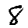
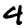
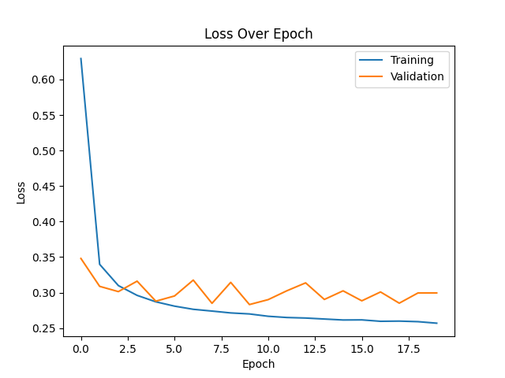

# PROVOST Iantsa & SOUCASSE Bastien — DLCV Lab 4

- Development
    - **Apple MacBook Air (2017)**
        - Intel Core i5 Chip: 1.8GHz dual-core Intel Core i5, Turbo Boost up to 2.9GHz, with 3MB shared L3 cache.
    - **Apple MacBook Air (2020)**
        - Apple M1 Chip: 8-core CPU with 4 perform­ance cores and 4 efficiency cores, 7-core GPU, and 16-core Neural Engine.
- Testing
    - **CREMI (vlaminck)**
        - 6-Core E-2236 32Go CPU, and RTX 2060 (6Go) GPU.

# Keras

## 1. Convolutional Neural Network on MNIST Dataset

### 1.2. First CNN

*N.B.:* After running the program with 40 epochs and realizing it takes a lot of time, we decided to lower the number of epochs to 20. Indeed, the results seems to stabilize around that number.

#### Model Summary

|   ID   |  Loss  | Accuracy | Training Time |
| :----: | :----: | :------: | :-----------: |
| model1 | 0.2940 |  91.96%  |    46.96s     |

- Convolution: 32, 3, 1, 'valid'.
- Flatten.
- Fully Connected: 10, 'softmax'.

 

#### Loss and Accuracy Plots

 

We may think this first model is overfitting. But is it ???? 
<!-- TODO -->

 

#### Confusion Matrix

 

The diagonal is where there are the higher numbers, which is a good thing since it represents the true positives. When it comes to misclassified images, we can observe that the most misclassified digits are:
- 5 misclassified as 3 (34)
- 8 misclassified as 5 (37)
- 9 misclassified as 4 (42)

 

#### 10 Worst Classified Images

First of all, let's define what we mean by "badly classified" images. Here, we consider an image badly classified if:
- it is misclassified
- the probability predicted by the model that it's their actual category is low

As a consequence, we decided to gather all the misclassified images and selected the ones that had the ten lowest predicted probability for their actual class.

 

| Rank  | Image idx | Pred. cat. | Act cat. |                     Images                      |
| :---: | :-------: | :--------: | :------: | :---------------------------------------------: |
|  10   |   1727    |     7      |    3     |  |
|   9   |   6511    |     5      |    3     |   |
|   8   |   4910    |     4      |    9     |   |
|   7   |    565    |     9      |    4     |   |
|   6   |   5874    |     3      |    5     |   |
|   5   |   7786    |     7      |    9     |   |
|   4   |   8297    |     5      |    8     |   |
|   3   |   7689    |     5      |    8     |   |
|   2   |   3862    |     3      |    2     |   |
|   1   |   2371    |     9      |    4     |   |

 

<!-- TODO: Comment those results -->
Note that this ranking is for an arbitrary run(ning)?.

In this ranking, we can notice that there are the most confusions between:
- 5 and 3 (2)
- 5 and 8 (2)
- 4 and 9 (3)

Looking back at the confusion matrix, we can see that those 3 confusions all appear in the most misclassified digits list, at least in one way (the two ways being x misclassified as y, and y miscalssified as x).

 

### 1.3. Comparison

Here are the configuration and results of the best model we obtained on lab3.3.

|    Model    | Accuracy |  Time  |
| :---------: | :------: | :----: |
| best lab3.3 |  97.59%  | 42.64s |
|   model1    |  91.96%  | 46.96s |

The CNN model takes a little bit more time (5s) than the lab3.3 best model and provides an about 5% lower accuracy. For now, the CNN model is not better but it must be improvable.

 

### 1.4. Model Improvment

…

  

## 2. Convolutional Neural Network on CIFAR10 Dataset

## 3. Data Augmentation

## 4. Transfer Learning / Fine-Tuning on CIFAR10 Dataset

# PyTorch

## 1. Convolutional Neural Network on MNIST Dataset

### 1.2. First CNN

#### Model Summary

|   ID   |  Loss  | Accuracy | Training Time |
| :----: | :----: | :------: | :-----------: |
| model1 | 0.2957 |  91.67%  |    102.06s    |

#### Architecture

- Convolution: 32, 3, 1, 'valid'.
- Flatten.
- Fully Connected: 10 ('softmax').

*N.B.:* In PyTorch, the Softmax activation is already done by the CrossEntropyLoss criterion, as mentionned in the [official documentation](https://pytorch.org/docs/stable/generated/torch.nn.CrossEntropyLoss.html): "Note that this is equivalent to the combination of LogSoftmax and NLLLoss."

 

#### Loss and Accuracy Plots

…

 

#### Confusion Matrix

…

 

#### 10 Worst Classified Images

| Rank  | Image idx | Pred. cat. | Act cat. |
| :---: | :-------: | :--------: | :------: |
|  10   |     X     |     X      |    X     |
|   9   |     X     |     X      |    X     |
|   8   |     X     |     X      |    X     |
|   7   |     X     |     X      |    X     |
|   6   |     X     |     X      |    X     |
|   5   |     X     |     X      |    X     |
|   4   |     X     |     X      |    X     |
|   3   |     X     |     X      |    X     |
|   2   |     X     |     X      |    X     |
|   1   |     X     |     X      |    X     |

…

 

### 1.3. Comparison

|    Model    | Accuracy |  Time   |
| :---------: | :------: | :-----: |
| best lab3.3 |  97.59%  | 42.64s  |
|   model1    |  91.67%  | 102.06s |

 

### 1.4. Model Improvment

#### Model Summary

|   ID   |  Loss  | Accuracy | Training Time |
| :----: | :----: | :------: | :-----------: |
| model2 | 0.0988 |  97.98%  |    104.65s    |

#### Architecture

- Convolution: 64, 3, 1, 'valid'.
- Convolution: 32, 3, 1, 'valid'.
- Maximum Pooling: 2, 1, 'valid'.
- Convolution: 16, 3, 1, 'valid'.
- Flatten.
- Fully Connected: 10 ('softmax').

 

#### Loss and Accuracy Plots

…

 

#### Confusion Matrix

…

 

#### 10 Worst Classified Images

| Rank  | Image idx | Pred. cat. | Act cat. |
| :---: | :-------: | :--------: | :------: |
|  10   |     X     |     X      |    X     |
|   9   |     X     |     X      |    X     |
|   8   |     X     |     X      |    X     |
|   7   |     X     |     X      |    X     |
|   6   |     X     |     X      |    X     |
|   5   |     X     |     X      |    X     |
|   4   |     X     |     X      |    X     |
|   3   |     X     |     X      |    X     |
|   2   |     X     |     X      |    X     |
|   1   |     X     |     X      |    X     |

…

 

## 2. Convolutional Neural Network on CIFAR10 Dataset

## 3. Data Augmentation

## 4. Transfer Learning / Fine-Tuning on CIFAR10 Dataset
