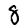

# PROVOST Iantsa & SOUCASSE Bastien — DLCV Lab 4

- Development
    - **Apple MacBook Air (2017)**
        - Intel Core i5 Chip: 1.8GHz dual-core Intel Core i5, Turbo Boost up to 2.9GHz, with 3MB shared L3 cache.
    - **Apple MacBook Air (2020)**
        - Apple M1 Chip: 8-core CPU with 4 perform­ance cores and 4 efficiency cores, 7-core GPU, and 16-core Neural Engine.
- Testing
    - **CREMI (vlaminck)**
        - 6-Core E-2236 32Go CPU, and RTX 2060 (6Go) GPU.

  

# Keras

## 1. Convolutional Neural Network on MNIST Dataset

### 1.2. First CNN

*N.B.:* After running the program with 40 epochs and realizing it takes a lot of time, we decided to lower the number of epochs to 20. Indeed, the results seems to stabilize around that number.

#### Model Summary

|   ID   |  Loss  | Accuracy | Training Time |
| :----: | :----: | :------: | :-----------: |
| model1 | 0.2940 |  91.96%  |    46.96s     |

- Convolution: 32, 3, 1, 'valid'.
- Flatten.
- Fully Connected: 10, 'softmax'.

 

#### Loss and Accuracy Plots

 

We may think this first model is overfitting. But is it ???? YES IT IS
<!-- TODO -->

 

#### Confusion Matrix

 

The diagonal is where there are the higher numbers, which is a good thing since it represents the true positives. When it comes to misclassified images, we can observe that the most misclassified digits are:
- 5 as 3 (34)
- 8 as 5 (37)
- 9 as 4 (42)

 

#### 10 Worst Classified Images

First of all, let's define what we mean by "badly classified" images. Here, we consider an image badly classified if:
- it is misclassified
- the probability predicted by the model that it's their actual category is low

As a consequence, we decided to gather all the misclassified images and selected the ones that had the ten lowest predicted probability for their actual class.

 

| Rank  | Image idx | Pred. cat. | Act cat. |                     Images                      |
| :---: | :-------: | :--------: | :------: | :---------------------------------------------: |
|  10   |   1727    |     7      |    3     |  |
|   9   |   6511    |     5      |    3     |   |
|   8   |   4910    |     4      |    9     |   |
|   7   |    565    |     9      |    4     |   |
|   6   |   5874    |     3      |    5     |   |
|   5   |   7786    |     7      |    9     |   |
|   4   |   8297    |     5      |    8     |   |
|   3   |   7689    |     5      |    8     |   |
|   2   |   3862    |     3      |    2     |   |
|   1   |   2371    |     9      |    4     |   |

 

Note that this ranking is for an arbitrary run(ning)?.

In this ranking, we can notice that there are the most confusions between:
- 5 and 3 (2)
- 5 and 8 (2)
- 4 and 9 (3)

Looking back at the confusion matrix, we can see that those 3 confusions all appear in the most misclassified digits list, at least in one way (the two ways being x misclassified as y, and y miscalssified as x).

 

### 1.3. Comparison

Here are the configuration and results of the best model we obtained on lab3.3.

|    Model    | Accuracy |  Time  |
| :---------: | :------: | :----: |
| best lab3.3 |  97.59%  | 42.64s |
|   model1    |  91.96%  | 46.96s |

The CNN model takes a little bit more time (5s) than the lab3.3 best model and provides an about 5% lower accuracy. For now, the CNN model is not better but it must be improvable.

 

### 1.4. Model Improvement

### 1.4.1. A new architecture

Let's use a basic architecture given in class. Maybe this one will not overfit.

#### Model Summary

|   ID   |  Loss  | Accuracy | Training Time |
| :----: | :----: | :------: | :-----------: |
| model2 | 0.5195 |  97.81%  |    144.61s    |

- Convolution: 32, 3, 1, 'valid'.
- Convolution: 64, 3, 1, 'valid'.
- Maximum Pooling: 2, 1, 'valid'.
- Convolution: 16, 3, 1, 'valid'.
- Flatten.
- Fully Connected: 10, 'softmax'.

This model's accuracy is much better, it even reaches the lab3.3 best model accuracy. However, the training time is way longer (about 3 times), but it remains reasonable.

 

#### Loss and Accuracy Plots

 

This time, it is clear that our model is **overfitting**. Indeed, even though we got a very good accuracy and the training loss is decreasing as expected, the validation loss is increasing.

 

#### Confusion Matrix

 

Just like the first model, the diagonal is where there are the higher numbers. Moreover there are very few misclassified images (which is logical since the accuracy is higher). When it comes to misclassified images, we can observe that the most misclassified digits are:
- 6 as 0 (10)
- 8 as 7 (10)
- 5 as 3 (11) (also noticed in first model)
- 7 as 2 (12)
- 9 as 7 (19)

There are less misclassified images but more categories.

 

#### 10 Worst Classified Images

*N.B.*: To know what is meant by "10 worst classified images", see same section in **1.2**.

 

| Rank  | Image idx | Pred. cat. | Act cat. |                     Images                      |
| :---: | :-------: | :--------: | :------: | :---------------------------------------------: |
|  10   |   7813    |     8      |    9     |  |
|   9   |   2135    |     1      |    6     |   |
|   8   |   2298    |     0      |    8     |   |
|   7   |    290    |     5      |    8     |   |
|   6   |   5936    |     9      |    4     |   |
|   5   |   4838    |     5      |    6     |   |
|   4   |   9982    |     6      |    5     |   |
|   3   |   2770    |     7      |    3     |   |
|   2   |   7886    |     4      |    2     |   |
|   1   |   3794    |     3      |    8     |   |

 

First of all, none of the images in this ranking appear in the first model ranking.
Then, we can only observe 1 confusion in both ways between 5 and 6, which was not in the first model ranking. Also this confusion doesn't appear in the most misclassified images. But, they look "harder to recognize" (such as the 7th, 8th and 9th) than the ones in the first model.

 

### 1.4.2. Fighting against overfitting

## 2. Convolutional Neural Network on CIFAR10 Dataset

  

# PyTorch

## 1. Convolutional Neural Network on MNIST Dataset

### 1.1. First CNN

#### Model Summary

|   ID   |  Loss  | Accuracy | Training Time |
| :----: | :----: | :------: | :-----------: |
| model1 | 0.2957 |  91.67%  |    102.06s    |

- Convolution: 32, 3, 1, 'valid'.
- Flatten.
- Fully Connected: 10 ('softmax').

 

#### Loss and Accuracy Plots

These plots may show some overfitting, but not much. There is less overfitting than with Keras.

 

#### Confusion Matrix

As in Keras, the confusion matrix shows that most the images are well classified (the diagonal). The most misclassified digits are:

- 7 as 9 (38)
- 5 as 3 (38)
- 2 as 8 (48)

 

#### Nota Bene

In PyTorch, the Softmax activation is already done by the CrossEntropyLoss criterion, as mentionned in the [official documentation](https://pytorch.org/docs/stable/generated/torch.nn.CrossEntropyLoss.html): "Note that this is equivalent to the combination of LogSoftmax and NLLLoss." (That's why we put softmax between parenthesis.)

As we didn't know this at first, we did a first version of this model with a softmax activation on the linear layer. The results were drastically different.

The confusion matrix shows that not only the elements are not well classified, but also some classes are nerver predicted.

  

### 1.2. Model Improvement

#### Model Summary

|   ID   |  Loss  | Accuracy | Training Time |
| :----: | :----: | :------: | :-----------: |
| model2 | 0.0988 |  97.98%  |    104.65s    |

- Convolution: 64, 3, 1, 'valid'.
- Convolution: 32, 3, 1, 'valid'.
- Maximum Pooling: 2, 1, 'valid'.
- Convolution: 16, 3, 1, 'valid'.
- Flatten.
- Fully Connected: 10 ('softmax').

 

#### Loss and Accuracy Plots

This time, there is an obvious overfitting detected as the trainling loss keeps descending but the validation one is stabilizing and ever ascending.

 

#### Confusion Matrix

However, the confusion matrix—and the accuracy—still shows that most of the images are classified correctly.

 

### 1.3. Fighting Against Overfitting

#### Model Summary

|   ID   |  Loss  | Accuracy | Training Time |
| :----: | :----: | :------: | :-----------: |
| model3 | 0.0499 |  98.36%  |    106.86s    |

- Convolution: 64, 3, 1, 'valid'.
- Convolution: 32, 3, 1, 'valid'.
- Dropout.
- Activation: 'relu'.
- Maximum Pooling: 2, 1, 'valid'.
- Convolution: 16, 3, 1, 'valid'.
- Flatten.
- Fully Connected: 10 ('softmax').

 

#### Loss and Accuracy Plots

…

 

#### Confusion Matrix

…

<!-- [model4] loss: 0.0449, accuracy: 0.9898, training time: 121.13s -->

  

## 2. Convolutional Neural Network on CIFAR10 Dataset

