# PROVOST Iantsa & SOUCASSE Bastien — DLCV Lab 4

- Development
    - **Apple MacBook Air (2017)**
        - Intel Core i5 Chip: 1.8GHz dual-core Intel Core i5, Turbo Boost up to 2.9GHz, with 3MB shared L3 cache.
    - **Apple MacBook Air (2020)**
        - Apple M1 Chip: 8-core CPU with 4 perform­ance cores and 4 efficiency cores, 7-core GPU, and 16-core Neural Engine.
- Testing
    - **CREMI (201)**
        - Intel Xeon W-1290 12-core CPU, and RTX 3060 12Go GPU.

  

# Keras

## 1. Convolutional Neural Network on MNIST Dataset

### 1.2. First CNN

*N.B.:* After running the program with 40 epochs and realizing it takes a lot of time, we decided to lower the number of epochs to 20. Indeed, the results seem to stabilize around that number.

#### Model Summary

|   ID   |  Loss  | Accuracy | Training Time |
| :----: | :----: | :------: | :-----------: |
| model1 | 0.2940 |  91.96%  |    46.96s     |

- Conv2D: 32, 3, 1, 'valid'.
- Flatten.
- Dense: 10, 'softmax'.

 

#### Loss and Accuracy Plots

 

The plots for training data seem normal, but the validation data give don't follow: the model is overfitting. 

 

#### Confusion Matrix

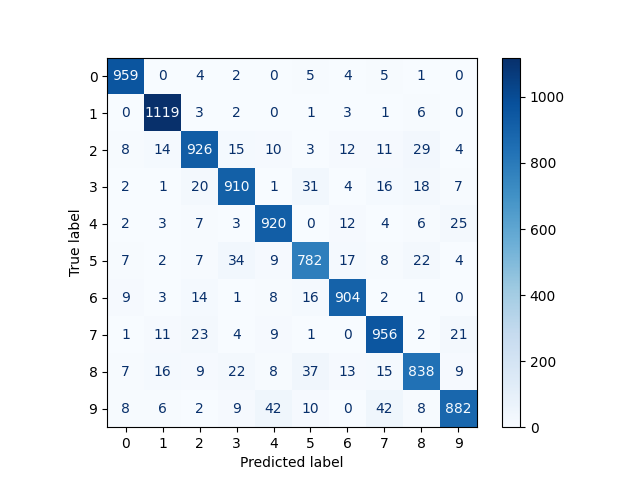

 

The diagonal is where there are the higher numbers, which is a good thing since it represents the true positives. When it comes to misclassified images, we can observe that the most misclassified digits are:
- 5 as 3 (34)
- 8 as 5 (37)
- 9 as 4 (42)
- 9 as 7 (42)

 

#### 10 Worst Classified Images

First of all, let's define what we mean by "badly classified" images. Here, we consider an image badly classified if:
- it is misclassified
- the probability predicted by the model that it's their actual category is low

As a consequence, we decided to gather all the misclassified images and selected the ones that had the ten lowest predicted probability for their actual class.

 

| Rank  | Image Idx. | Pred. Cat. | Act. Cat. |                      Image                      |
| :---: | :--------: | :--------: | :-------: | :---------------------------------------------: |
|  10   |    1727    |     7      |     3     |  |
|   9   |    6511    |     5      |     3     |   |
|   8   |    4910    |     4      |     9     |   |
|   7   |    565     |     9      |     4     | 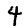  |
|   6   |    5874    |     3      |     5     |   |
|   5   |    7786    |     7      |     9     |   |
|   4   |    8297    |     5      |     8     |   |
|   3   |    7689    |     5      |     8     |   |
|   2   |    3862    |     3      |     2     |   |
|   1   |    2371    |     9      |     4     |   |

 

Note that this ranking is for an arbitrary run.

In this ranking, we can notice that there are the most confusions between:
- 5 and 3 (2)
- 5 and 8 (2)
- 4 and 9 (3)

Looking back at the confusion matrix, we can see that those 3 confusions all appear in the most misclassified digits list, at least in one way (the two ways being x misclassified as y, and y miscalssified as x).

 

### 1.3. Comparison

|    Model    | Accuracy |  Time  |
| :---------: | :------: | :----: |
| best lab3.3 |  97.59%  | 42.64s |
|   model1    |  91.96%  | 46.96s |

The CNN model takes a little bit more time (5s) than the lab3.3 best model and provides an about 5% lower accuracy. For now, the CNN model is not better but it must be improvable.

 

### 1.4. Model Improvement

### 1.4.1. A New Architecture

Let's use an architecture more complex given in class.

#### Model Summary

|   ID   |  Loss  | Accuracy | Training Time |
| :----: | :----: | :------: | :-----------: |
| model2 | 0.5195 |  97.81%  |    144.61s    |

- Conv2D: 32, 3, 1, 'valid'.
- Conv2D: 64, 3, 1, 'valid'.
- MaxPooling: 2, 1, 'valid'
- Conv2D: 128, 3, 1, 'valid'.
- Flatten.
- Dense: 10, 'softmax'.

This model's accuracy is much better, it even reaches the lab3.3 best model accuracy. However, the training time is way longer (about 3 times), but it remains reasonable.

 

#### Loss and Accuracy Plots

 

Our model is definitely **overfitting** but later than model1. Indeed, even though we got a very good accuracy and the training loss is decreasing as expected, the validation loss is increasing.

 

#### Confusion Matrix

 

Just like the first model, the diagonal is where there are the higher numbers. Moreover there are very few misclassified images (which is logical since the accuracy is higher). When it comes to misclassified images, we can observe that the most misclassified digits are:
- 6 as 0 (10)
- 8 as 7 (10)
- 5 as 3 (11) (also noticed in first model)
- 7 as 2 (12)
- 9 as 7 (19)

There are less misclassified images but more categories.

 

#### 10 Worst Classified Images

*N.B.*: To know what is meant by "10 worst classified images", see same section in **1.2**.

 

| Rank  | Image Idx. | Pred. Cat. | Act. Cat. |                      Image                      |
| :---: | :--------: | :--------: | :-------: | :---------------------------------------------: |
|  10   |    7813    |     8      |     9     |  |
|   9   |    2135    |     1      |     6     |   |
|   8   |    2298    |     0      |     8     |   |
|   7   |    290     |     5      |     8     |   |
|   6   |    5936    |     9      |     4     |   |
|   5   |    4838    |     5      |     6     |   |
|   4   |    9982    |     6      |     5     |   |
|   3   |    2770    |     7      |     3     |   |
|   2   |    7886    |     4      |     2     |   |
|   1   |    3794    |     3      |     8     |   |

 

First of all, none of the images in this ranking appear in the first model ranking.
Then, we can only observe 1 confusion in both ways between 5 and 6, which was not in the first model ranking. Also this confusion doesn't appear in the most misclassified images. But, they look "harder to recognize" (such as the 7th, 8th and 9th) than the ones in the first model.

 

### 1.4.2. Fighting Against Overfitting

This time, let's build a model with data normalization, to prevent overfitting. And then, try and improve its accuracy.

#### Model Summaries

Legend:
- Conv2D: num_filters, kernel_size, stride, padding.
- MaxPooling: pool_size, stride, padding.

|   ID   | Architecture                                                                                                                                                                                                         |  Loss  | Accuracy | Training time |
| :----: | :------------------------------------------------------------------------------------------------------------------------------------------------------------------------------------------------------------------- | :----: | :------: | :-----------: |
| model3 | - Conv2D: 32, `5`, 1, 'valid'   - Conv2D: 64, 5, 1, 'valid'   - `BatchNorm`   - MaxPooling: 2, 1, 'valid'   - Conv2D: 128, 5, 1, 'valid'   - Flatten   - Dense: 10, 'softmax'          | 0.2406 |  98.12%  |    143.87s    |
| model4 | - Conv2D: 32, `5`, 1, 'valid'   - Conv2D: 64, 5, 1, 'valid'   - `BatchNorm`   - MaxPooling: 2, `2`, 'valid'   - Conv2D: 128, 5, 1, 'valid'   - Flatten   - Dense: 10, 'softmax'        | 0.2260 |  98.13%  |    113.17s    |
| model5 | - Conv2D: `64`, `5`, 1, 'valid'   - Conv2D: `128`, 5, 1, 'valid'   - `BatchNorm`   - MaxPooling: 2, `2`, 'valid'   - Conv2D: `256`, 5, 1, 'valid'   - Flatten   - Dense: 10, 'softmax' | 0.3216 |  98.04%  |    211.00s    |

Those 3 new models provide rather identical accuracies, that are slightly better than the model2 one. The training time allows to decide between them. Indeed, even if these information are not sufficient to choose a model, model4 seems to be the best model so far.

#### Loss, Accuracy Plots and Confusion Matrices

 

|   ID   |                         Loss Plot                          |                         Accuracy Plot                          |                            Confusion Matrix                            |
| :----: | :--------------------------------------------------------: | :------------------------------------------------------------: | :--------------------------------------------------------------------: |
| model3 |  |  |  |
| model4 |  |  |  |
| model5 |  |  |  |

Whether it is about loss or accuracy, for all 3 models, we can observe some overfitting since the training values are improving and not the validation ones.
Nevertheless, the scale is small so even if it may look huge, they actually all have:
- about 0.2-0.25 delta for the loss
- +/- 0.2 delta for the accuracy

They all look quite equivalent. More importantly, they show better results than model2. 

 

#### 10 Worst Classified Images

|       |   model3   |            |           |                                                 |   model4   |            |           |                                                 |   model5   |            |           |                                                 |
| :---: | :--------: | :--------: | :-------: | :---------------------------------------------: | :--------: | :--------: | :-------: | :---------------------------------------------: | :--------: | :--------: | :-------: | :---------------------------------------------: |
| Rank  | Image Idx. | Pred. Cat. | Act. Cat. |                      Image                      | Image Idx. | Pred. Cat. | Act. Cat. |                      Image                      | Image Idx. | Pred. Cat. | Act. Cat. |                      Image                      |
|  10   |    4196    |     9      |     5     |  |    3559    |     5      |     8     |  |    9614    |     5      |     3     |  |
|   9   |    924     |     7      |     2     |   |    9904    |     8      |     2     |   |    4534    |     7      |     9     |   |
|   8   |    6157    |     5      |     9     |   |    9698    |     5      |     6     |   |    6624    |     5      |     3     |   |
|   7   |    6166    |     3      |     9     |   |    1101    |     3      |     8     |   |    5922    |     3      |     5     |   |
|   6   |    9645    |     7      |     1     |   |    9331    |     3      |     5     |   |    1686    |     6      |     8     |   |
|   5   |    5176    |     4      |     8     |   |    5265    |     4      |     6     |   |    4783    |     9      |     4     |   |
|   4   |    1138    |     1      |     2     |   |    6651    |     8      |     0     |   |    2406    |     4      |     9     |   |
|   3   |    543     |     7      |     8     |   |    6391    |     4      |     2     |   |    3941    |     6      |     4     |   |
|   2   |    4256    |     2      |     3     |   |    5745    |     1      |     7     |   |    2189    |     8      |     9     |   |
|   1   |    2369    |     3      |     5     |   |    9638    |     7      |     9     |   |    3951    |     7      |     8     |   |

  

## 2. Convolutional Neural Network on CIFAR10 Dataset

### 2.2. First CNN
### Model Summary

|   ID   |  Loss  | Accuracy | Training Time |
| :----: | :----: | :------: | :-----------: |
| model1 | 1.9821 |  33.35%  |    53.39s     |

- Conv2D: 32, 3, 1, 'valid'.
- Flatten.
- Dense: 10, 'softmax'.

 

#### Loss and Accuracy Plots

 

Not only the accuracy is low, but both loss and accuracy plots show overfitting. This model is not satisfactory at all. 

 

#### Confusion Matrix

 

The confusion matrix looks bad: there is no high value diagonal. It adds a proof that the model is bad.

 

#### 10 Worst Classified Images

| Rank  | Image Idx. | Pred. Cat. | Act. Cat. |                      Image                      |
| :---: | :--------: | :--------: | :-------: | :---------------------------------------------: |
|  10   |    7451    |    Car     |   Truck   |  |
|   9   |    7196    |    Ship    |   Plane   |   |
|   8   |    8309    |    Frog    |   Deer    |   |
|   7   |    5918    |   Truck    |    Car    |   |
|   6   |    7811    |    Ship    |   Plane   |   |
|   5   |    1889    |    Ship    |   Truck   |   |
|   4   |    7455    |   Truck    |    Car    |   |
|   3   |    4971    |    Car     |   Truck   |   |
|   2   |    3024    |    Ship    |   Plane   |   |
|   1   |    5008    |   Horse    |   Deer    |   |

 

### 1.3. Comparison

|    Model    | Accuracy |  Time  |
| :---------: | :------: | :----: |
| best lab3.3 |  44.50%  | 46.06s |
|   model1    |  33.35%  | 53.39s |

Our best lab3.3. model gives a more than 10% better accuracy than our first CNN model. Let's try to improve it.

 

### 1.4. Model Improvement

#### Model Summaries

Legend:
- Conv2D: num_filters, kernel_size, stride, padding.
- MaxPooling: pool_size, stride, padding.
- Dense: units, activation_function.

|   ID   | Architecture                                                                                                                                                                                                                                                                                                                   |  Loss  | Accuracy | Training time |
| :----: | :----------------------------------------------------------------------------------------------------------------------------------------------------------------------------------------------------------------------------------------------------------------------------------------------------------------------------- | :----: | :------: | :-----------: |
| model5 | - Conv2D: 64, 5, 1, 'valid'   - Conv2D: 128, 5, 1, 'valid'   - BatchNorm   - MaxPooling: 2, 2, 'valid'   - Conv2D: 256, 5, 1, 'valid'   - Flatten   - Dense: 10, 'softmax'                                                                                                                       | 1.5979 |  55.96%  |    200.59s    |
| model6 | - Conv2D: 64, 5, 1, 'valid'   - MaxPooling: 2, 2, 'valid'   - BatchNorm   - Conv2D: 128, 5, 1, 'valid'   - MaxPooling: 2, 2, 'valid'    - BatchNorm   - Flatten   - Dense: 128, 'relu'   - Dense: 10, 'softmax'                                                                        | 3.3476 |  63.78%  |    95.43s     |
| model7 | - Conv2D: 64, 5, 1, 'valid'   - Conv2D: 64, 5, 1, 'valid'   - MaxPooling: 2, 2, 'valid'   - BatchNorm   - Conv2D: 128, 5, 1, 'valid'   - Conv2D: 128, 5, 1, 'valid'   - MaxPooling: 2, 2, 'valid'    - BatchNorm   - Flatten   - Dense: 128, 'relu'   - Dense: 10, 'softmax' | 1.3447 |  68.57%  |    158.78s    |

The accuracy increases through the different models. What's more, the one giving the best accuracy (model7) is not even the slower one. 68% might not seem a great accuracy, but it doubled since model1 which is good news.

 

#### Loss, Accuracy Plots and Confusion Matrices

|   ID   |                         Loss Plot                          |                         Accuracy Plot                          |                            Confusion Matrix                            |
| :----: | :--------------------------------------------------------: | :------------------------------------------------------------: | :--------------------------------------------------------------------: |
| model5 |  |  |  |
| model6 |  |  |  |
| model7 |  |  |  |

Compared to model1, the confusion matrices are much better: they all present the famous diagonal.

Even though we managed to improve the accuracy, it's becoming harder to fight overfitting. Indeed, all 3 models show a lot of overfitting. (Notice that the last one looks like it's slightly less overfitting???)

 

#### 10 Worst Classified Images

|       |   model5   |            |           |                                                 |   model6   |            |           |                                                 |   model7   |            |           |                                                 |
| :---: | :--------: | :--------: | :-------: | :---------------------------------------------: | :--------: | :--------: | :-------: | :---------------------------------------------: | :--------: | :--------: | :-------: | :---------------------------------------------: |
| Rank  | Image Idx. | Pred. Cat. | Act. Cat. |                      Image                      | Image Idx. | Pred. Cat. | Act. Cat. |                      Image                      | Image Idx. | Pred. Cat. | Act. Cat. |                      Image                      |
|  10   |    9935    |   Truck    |    Car    |  |    5122    |    Cat     |   Frog    |  |    5251    |    Cat     |    Dog    |  |
|   9   |    2284    |   Plane    |   Ship    |   |    9206    |   Plane    |   Ship    |   |    1090    |    Ship    |   Plane   |   |
|   8   |    5040    |    Frog    |    Cat    |   |    7236    |   Truck    |    Car    |   |    8201    |    Frog    |    Cat    |   |
|   7   |    9407    |    Car     |   Frog    |   |    7329    |   Truck    |    Car    |   |    6760    |    Cat     |    Dog    |   |
|   6   |    5546    |    Deer    |   Horse   |   |    3253    |    Ship    |   Truck   |   |    6002    |   Plane    |   Bird    |   |
|   5   |    1433    |    Deer    |   Horse   |   |    2060    |    Cat     |    Dog    |   |    783     |    Ship    |   Frog    |   |
|   4   |    8915    |    Car     |   Truck   |   |    5729    |    Car     |   Ship    |   |    1631    |   Truck    |    Car    |   |
|   3   |    757     |   Plane    |   Ship    |   |    447     |    Ship    |   Plane   |   |    4721    |   Plane    |    Car    |   |
|   2   |    1272    |    Frog    |   Deer    |   |    1650    |    Bird    |    Dog    |   |    1653    |    Car     |   Truck   |   |
|   1   |    3549    |   Truck    |    Car    |   |    3402    |    Frog    |   Deer    |   |    9148    |    Dog     |    Cat    |   |

  

## 3. Data Augmentation on CIFAR10 dataset

Our last model (model7) is the best one we could get with a CNN so far, but it shows overfitting. One way to reduce overfitting is to increase the size of the training dataset. Let's try to improve our model by doing data augmentation on our dataset.

### 3.1. Results

#### Model Summaries

All the models described below are heritated from model7, so we will only specify the parameters of the `ImageDataGenerator` in the Architecture column.

|         ID          | Architecture                                                                                                                             | Epochs |  Loss  | Accuracy |          Training time           |
| :-----------------: | :--------------------------------------------------------------------------------------------------------------------------------------- | :----: | :----: | :------: | :------------------------------: |
|       model8        | - horizontal_flip=True   - height_shift_range=0.1   - width_shift_range=0.1   - rotation_range=10   - zoom_range=0.2 |   20   | 0.9139 |  69.78%  |             340.25s              |
|       model9        | - horizontal_flip=True   - height_shift_range=0.1   - width_shift_range=0.1                                                    |   20   | 0.8267 |  72.08%  |             323.14s              |
| model10 (model9bis) | - horizontal_flip=True   - height_shift_range=0.1   - width_shift_range=0.1                                                    |  100   | 0.7761 |  76.33%  | 1557.88s (311.58s for 20 epochs) |

 

|        ID        |                                 Images                                  |
| :--------------: | :---------------------------------------------------------------------: |
|     original     |                |
|      model8      |  |
| model9 & model10 | 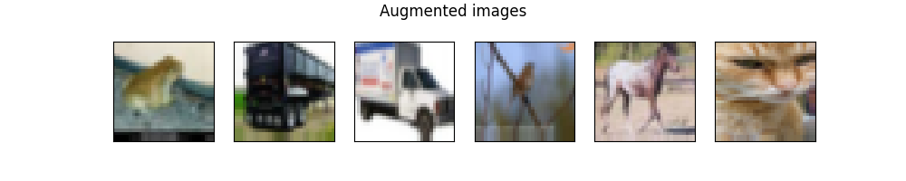 |

 

For model8, the parameters were chosen according to what is plausible for the subjects of our images. That's why we, for example, did not add a vertical flip (an upside down ship or truck makes no sense).
As for model9(bis), some parameters were removed as a test.
Finally, model10 is actually model9, but trained on 100 epochs.

When it comes to perfomance, the accuracy gets better as the training time goes down, which suggests that each model might be better than the previous one.
To confirm it, let's take a look at the plots.

 

#### Loss, Accuracy Plots and Confusion Matrices

|   ID    |                          Loss Plot                          |                          Accuracy Plot                          |                            Confusion Matrix                             |
| :-----: | :---------------------------------------------------------: | :-------------------------------------------------------------: | :---------------------------------------------------------------------: |
| model8  | 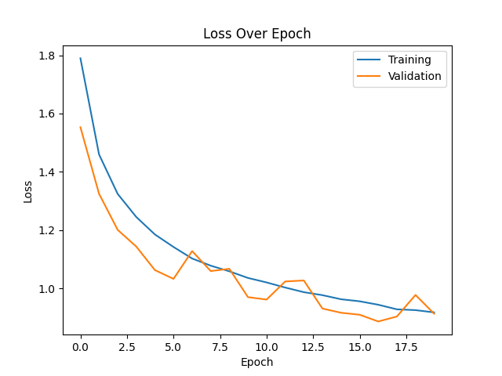  |   | 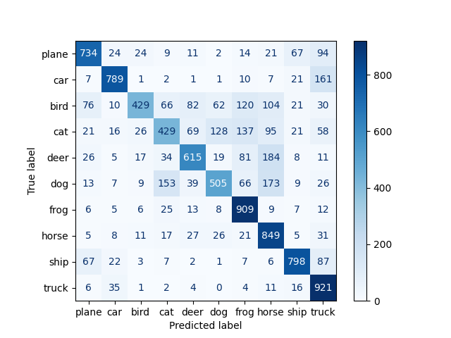  |
| model9  |   |   |   |
| model10 |  |  |  |

 

It was observed in the previous section (Model summaries) that our new models were providing better accuracies, but our main problem that we are trying to solve with data augmentation is overfitting. 
Looking at the model8 accuracy plot, we can see that the validation curve is above the test one. It could mean that the model is underfitting but the gap is not that big.

With model9, we managed to slightly reduce the gap a bit. Since the curves look like they keep going up, we trained it again on more epochs (model10).
Even though the test accuracy oscillates around the train accuracy, the test accuracy follows closely the train accuracy which means less/no overfitting.

 

#### 10 Worst Classified Images

|       |   model8   |            |           |            |                                                 |   model9   |            |           |            |                                                 |  model10   |            |           |            |                                                  |
| :---: | :--------: | :--------: | :-------: | :--------: | :---------------------------------------------: | :--------: | :--------: | :-------: | :--------: | :---------------------------------------------: | :--------: | :--------: | :-------: | :--------: | :----------------------------------------------: |
| Rank  | Image Idx. | Pred. Cat. | Act. Cat. | Prob. Act. |                      Image                      | Image Idx. | Pred. Cat. | Act. Cat. | Prob. Act. |                      Image                      | Image Idx. | Pred. Cat. | Act. Cat. | Prob. Act. |                      Image                       |
|  10   |    1396    |   Truck    |    Car    |   0.4971   |  |    7279    |    Cat     |    Dog    |   0.4975   |  |    6832    |   Truck    |    Car    |   0.4924   | 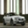 |
|   9   |    2063    |   Truck    |    Car    |   0.4951   |   |    6267    |    Car     |   Truck   |   0.4974   |   |    1051    |    Frog    |   Bird    |   0.4839   |   |
|   8   |    3404    |    Cat     |    Dog    |   0.4934   |   |    4005    |    Cat     |    Dog    |   0.4965   |   |    3094    |   Plane    |   Bird    |   0.4833   |   |
|   7   |    9141    |    Frog    |    Cat    |   0.4921   | 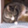  |    2964    |    Ship    |   Plane   |   0.4941   |   |    8884    |   Horse    |   Plane   |   0.4832   |   |
|   6   |    8595    |   Truck    |    Car    |   0.4904   |   |    8437    |    Deer    |   Horse   |   0.4930   |   |    2153    |   Plane    |   Ship    |   0.4783   |   |
|   5   |    9102    |    Deer    |   Horse   |   0.4885   |   |    9295    |    Dog     |    Cat    |   0.4929   | 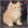  |    5805    |   Truck    |    Car    |   0.4771   |   |
|   4   |    7384    |    Dog     |    Cat    |   0.4873   |   |    9649    |    Cat     |    Dog    |   0.4925   |   |    5240    |   Truck    |    Car    |   0.4769   |   |
|   3   |    6055    |    Ship    |   Plane   |   0.4821   |   |    6228    |   Horse    |   Deer    |   0.4904   |   |    7942    |    Car     |   Truck   |   0.4742   |   |
|   2   |    6399    |   Truck    |    Car    |   0.4803   |   |    1733    |    Dog     |    Cat    |   0.4874   |   |    5085    |    Frog    |   Bird    |   0.4732   |   |
|   1   |    4125    |   Plane    |   Ship    |   0.4783   |   |    3130    |    Dog     |    Cat    |   0.4869   |   |    4421    |    Dog     |   Bird    |   0.4692   |   |

By analysing each ranking, we can observe that
- model8 tends to mistake Car as Truck (4 times)
- model9/10 also (Car as Truck 3 times, Truck as Car 1 time), and Cat as Dog, Dog as Cat (3 times each)

These classes are respectively of the same type of subject, and kind of look alike. Therefore, they are not aberrant mistakes.

  

### 3.2. Comparison

To conclude this part, let's compare our new best model (model10) with the ones of our original model (model7) that was the base.

|   ID    |                          Accuracy Plot                          | Accuracy |          Training time           |
| :-----: | :-------------------------------------------------------------: | :------: | :------------------------------: |
| model7  |   |  68.57%  |             158.78s              |
| model10 |  |  76.33%  | 1557.88s (311.58s for 20 epochs) |

In spite of an almost twice longer training time, model10 overperforms model7. 
Indeed, model10 provides an accuracy that is almost 8% higher and the problem of overfitting seems solved
(even if the plots are not on the same number of epochs, we do not need more epochs to see that the test accuracy will not get higher in model7).

  

## 4. Transfer learning / Fine-tuning on CIFAR10 dataset

### 4.1. Results

For this part, we are going to use ResNet50 pre-trained on ImageNet. 
We want to specify our input shape and remove the classifier to add our own so the model can classify 10 classes.

#### Model Summaries

Now that we know data augmentation helps improve results, we want to try fine-tuning with and without data augmentation.

|     ID     |   Data Augmentation   |  Loss  | Accuracy | Training time |
| :--------: | :-------------------: | :----: | :------: | :-----------: |
|  MyResNet  |          No           | 3.0612 |  73.63%  |   1153.49s    |
| MyResNetDA | Yes, same than model9 | 2.4440 |  76.15%  |   1172.44s    |

 

We expected MyResNetDA to provide a higher accuracy and it did, but very slightly (+3%).
As ResNet50 has 50 layers and none of them were frozen, it is trained entirely and so the training time is quite long (about 20 minutes).

 

#### Loss, Accuracy Plots and Confusion Matrices

|     ID     |                           Loss Plot                            |                           Accuracy Plot                            |                              Confusion Matrix                              |
| :--------: | :------------------------------------------------------------: | :----------------------------------------------------------------: | :------------------------------------------------------------------------: |
|  MyResNet  |    |    |    |
| MyResNetDA |  |  | 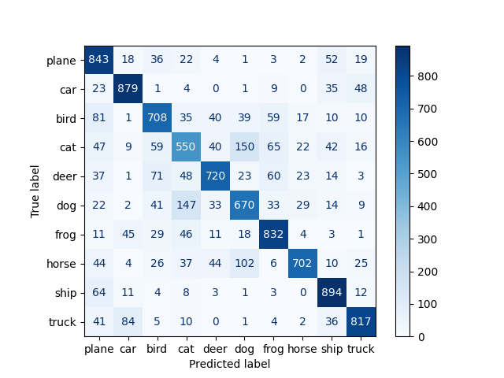 |

 

MyResNet's accuracy plot shows overfitting, whereas data augmentation seems to do its job in MyResNetDA.
Indeed, the test accuracy seems very close to train accuracy until around the 9th epoch (we couldn't figure out the drop). Then it gets back on track towards the end.

Although both confusion matrices look OK, with the diagonal representing the true positives, we cannot say the same about loss plots.
They look abnormal, and we unfortunately could not figure out why.

After many tries, with different types of normalization and/or layer freezing, we did not manage to get interesting/better results.

 

#### 10 Worst Classified Images

|       |  MyResNet  |            |           |            |                                                   | MyResNetDA |            |           |            |                                                     |
| :---: | :--------: | :--------: | :-------: | :--------: | :-----------------------------------------------: | :--------: | :--------: | :-------: | :--------: | :-------------------------------------------------: |
| Rank  | Image Idx. | Pred. Cat. | Act. Cat. | Prob. Act. |                       Image                       | Image Idx. | Pred. Cat. | Act. Cat. | Prob. Act. |                        Image                        |
|  10   |    3029    |   Truck    |    Car    |   0.4975   |  |    1771    |    Deer    |   Bird    |   0.4934   | 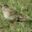 |
|   9   |    7970    |    Dog     |    Cat    |   0.4925   |   |    7639    |    Car     |   Truck   |   0.4913   |   |
|   8   |    9778    |    Dog     |    Cat    |   0.4895   |   |    6581    |   Truck    |    Car    |   0.4890   |   |
|   7   |    5432    |    Ship    |   Truck   |   0.4883   | 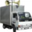  |    7093    |    Deer    |   Bird    |   0.4852   | 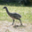  |
|   6   |    778     |    Ship    |   Plane   |   0.4871   |   |    8761    |    Ship    |   Plane   |   0.4848   |   |
|   5   |    169     |    Ship    |   Plane   |   0.4856   |   |    1549    |   Truck    |    Car    |   0.4822   |   |
|   4   |    2744    |    Car     |   Truck   |   0.4838   |   |    4223    |   Plane    |   Ship    |   0.4812   |   |
|   3   |     55     |   Plane    |   Ship    |   0.4825   |   |    2809    |    Frog    |   Deer    |   0.4778   |   |
|   2   |    7605    |    Deer    |   Bird    |   0.4733   | 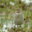  |    3182    |   Plane    |   Ship    |   0.4763   |   |
|   1   |    7714    |    Dog     |    Cat    |   0.4722   |   |    2879    |    Ship    |   Plane   |   0.4752   |   |

By analysing each ranking, we can observe that
- MyResNet tends to mistake Cat as Dog (3 times)
- MyResNetDA tends to mistake Ship as Truck and Truck as Ship (3 times in total)

In the same way than in the previous part about data augmentation, the mistakes done by our models are "understanble" since it confuses subjects that are of the "same type".

  

### 4.1. Comparison

To conclude this part, let's compare the model improvements (model10 and MyResNetDA), and our model from part 2 (model7).

|    ID    |                          Accuracy Plot                           | Accuracy |          Training time           |
| :------: | :--------------------------------------------------------------: | :------: | :------------------------------: |
|  model7  |    |  68.57%  |             158.78s              |
| model10  |   |  76.33%  | 1557.88s (311.58s for 20 epochs) |
| MyResNet |  |  76.15%  |             1172.44s             |

 

Our improved models (model10 and MyResNetDA) provides about the same accuracy but MyResNetDA overfits, unlike model10.
What is more, MyResNetDA is almost 4 times slower.

As a conclusion, MyResNetDA was able to improve model7 but could not compete with model10.

  

# PyTorch

## 1. Conv2D Neural Network on MNIST Dataset

### 1.1. First CNN

#### Model Summary

|   ID   |  Loss  | Accuracy | Training Time |
| :----: | :----: | :------: | :-----------: |
| model1 | 0.2996 |  91.74%  |    92.76s     |

- Conv2D: 32, 3, 1, 'valid'.
- Flatten.
- Dense: 10 ('softmax').

*N.B.:* This is the same model1 as with Keras to have the same base, but it won't be improved the same way as Keras, since we chose to improve it the most relevant way possible. This will allow us to have other CNN architectures giving good accuracies.

#### Loss and Accuracy Plots

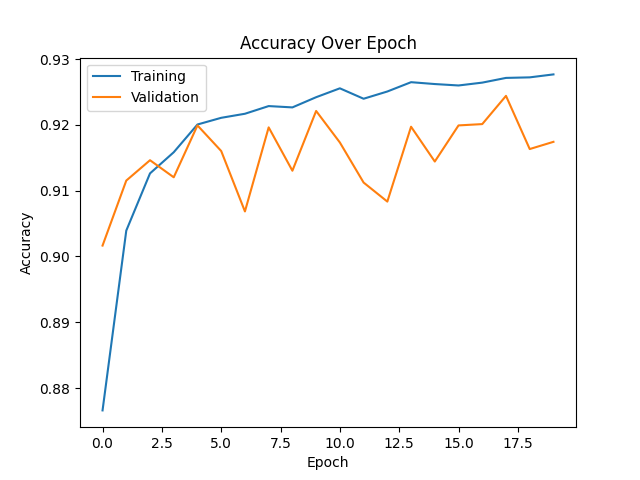

These plots may show some overfitting, but not much.

#### Confusion Matrix

As in Keras, the confusion matrix shows that most the images are well classified (the diagonal). The most misclassified digits are:
- 7 as 9 (35)
- 4 as 9 (38)
- 5 as 3 (51)

#### Nota Bene

In PyTorch, the Softmax activation is already done by the CrossEntropyLoss criterion, as mentionned in the [official documentation](https://pytorch.org/docs/stable/generated/torch.nn.CrossEntropyLoss.html): "Note that this is equivalent to the combination of LogSoftmax and NLLLoss." (That's why we put softmax between parenthesis.)

As we didn't know this at first, we did a first version of this model with a softmax activation on the linear layer. The results were drastically different.

The confusion matrix shows that not only the elements are not well classified, but also some classes are nerver predicted.

#### 10 Worst Classified Images

The same way as before, we're going to determine the 10 worst classified images by the model.

| Rank  | Image Idx. | Pred. Cat. | Act. Cat. |                       Image                       |
| :---: | :--------: | :--------: | :-------: | :-----------------------------------------------: |
|  10   |    6885    |     6      |     2     |  |
|   9   |    6599    |     1      |     7     |   |
|   8   |    9487    |     6      |     2     |   |
|   7   |    3189    |     4      |     7     |   |
|   6   |    5688    |     9      |     7     |   |
|   5   |    1940    |     0      |     5     |   |
|   4   |    1017    |     2      |     6     |   |
|   3   |    1310    |     7      |     3     |   |
|   2   |    3682    |     6      |     2     |   |
|   1   |    9916    |     9      |     7     |   |

 

### 1.2. Model Improvement

### 1.2.1. A New Architecture

Once again, we are going to complexify our architecture.

#### Model Summary

|   ID   |  Loss  | Accuracy | Training Time |
| :----: | :----: | :------: | :-----------: |
| model2 | 0.1276 |  97.20%  |    97.12s     |

- `Conv2D: 64, 3, 1, 'valid'.`
- Conv2D: 32, 3, 1, 'valid'.
- `MaxPooling: 2, 1, 'valid'.`
- `Conv2D: 16, 3, 1, 'valid'.`
- Flatten.
- Dense: 10 ('softmax').

This model is definitely better than the first one. For only a few seconds longer, it gives a 6 to 7 percent better accuracy.

#### Loss and Accuracy Plots

However this time, there is an obvious overfitting detected as the training loss keeps descending but the validation one is ascending.

#### Confusion Matrix

However, the confusion matrix—and also the accuracy obviously—still shows that most of the images are classified correctly.

#### 10 Worst Classified Images

| Rank  | Image Idx. | Pred. Cat. | Act. Cat. |                       Image                       |
| :---: | :--------: | :--------: | :-------: | :-----------------------------------------------: |
|  10   |    5593    |     6      |     0     |  |
|   9   |    5176    |     4      |     8     |   |
|   8   |     8      |     6      |     5     |   |
|   7   |    2370    |     6      |     0     |   |
|   6   |    6532    |     5      |     0     |   |
|   5   |    9614    |     5      |     3     |   |
|   4   |    8069    |     1      |     2     |   |
|   3   |    6847    |     4      |     6     |   |
|   2   |    5228    |     4      |     6     |   |
|   1   |    965     |     0      |     6     |   |

With this model, we're starting to understand why the neural network is wrong sometimes, as one might be wrong the same way on some images.

 

### 1.2.2. Fighting Against Overfitting

This time, let's build a model with data normalization, to prevent overfitting. And then, try and improve its accuracy.

#### Models Summaries

|   ID   | Architecture                                                                                                                                                                                                                                                             |  Loss  | Accuracy | Training time |
| :----: | :----------------------------------------------------------------------------------------------------------------------------------------------------------------------------------------------------------------------------------------------------------------------- | :----: | :------: | :-----------: |
| model3 | - Conv2D: 64, 3, 1, 'valid'.   - Conv2D: 32, 3, 1, 'valid'.   - `Dropout.`   - `Activation: 'relu'.`   - MaxPooling: 2, 1, 'valid'.   - Conv2D: 16, 3, 1, 'valid'.   - Flatten.   - Dense: 10 ('softmax').                            | 0.0456 |  98.55%  |    98.83s     |
| model4 | - Conv2D: 64, 3, 1, 'valid'.   - Conv2D: 32, 3, 1, 'valid'.   - Dropout.   - Activation: 'relu'.   - MaxPooling: 2, 1, 'valid'.   - Conv2D: 16, 3, 1, 'valid'.   - Flatten.   - `Dense: 128, 'relu'.`   - Dense: 10 ('softmax'). | 0.0432 |  98.76%  |    103.71s    |

The 2 new models provide rather identical results, slightly better than the model2 ones.

|   ID   |                          Loss Plot                           |                          Accuracy Plot                           |                             Confusion Matrix                             |
| :----: | :----------------------------------------------------------: | :--------------------------------------------------------------: | :----------------------------------------------------------------------: |
| model3 |  | 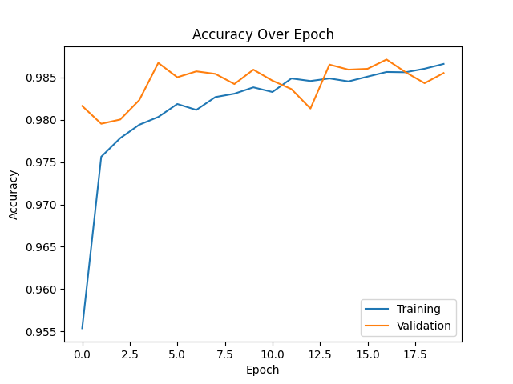 | 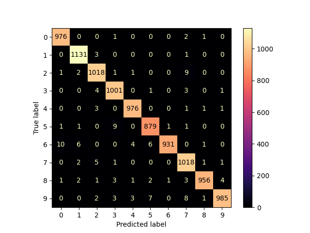 |
| model4 | 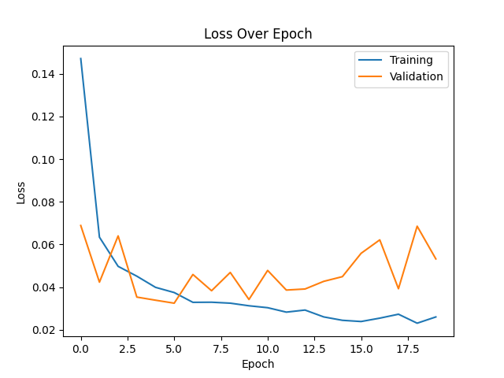 | 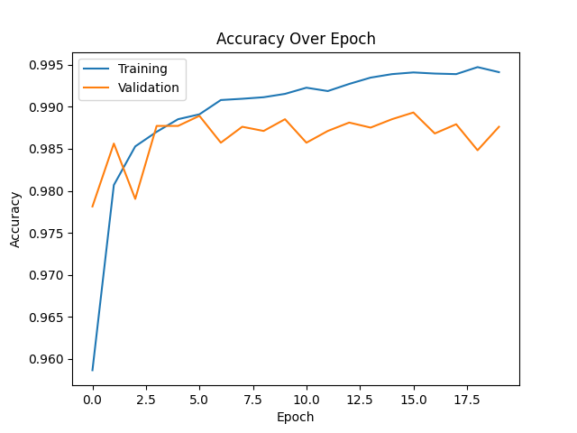 |  |

Here, model3 seems to have less overfitting, but it depends also on the run as the difference is very subtle.

|       |   model3   |            |           |                                                   |   model4   |            |           |                                                   |
| :---: | :--------: | :--------: | :-------: | :-----------------------------------------------: | :--------: | :--------: | :-------: | :-----------------------------------------------: |
| Rank  | Image Idx. | Pred. Cat. | Act. Cat. |                       Image                       | Image Idx. | Pred. Cat. | Act. Cat. |                       Image                       |
|  10   |    1147    |     7      |     4     |  |    2953    |     5      |     3     |  |
|   9   |    8059    |     1      |     2     |   |    5937    |     3      |     5     |   |
|   8   |    9664    |     7      |     2     |   |    6091    |     5      |     9     |   |
|   7   |    4063    |     5      |     6     |   |    359     |     4      |     9     |   |
|   6   |    4838    |     5      |     6     |   |    2130    |     9      |     4     |   |
|   5   |    3073    |     2      |     1     |   |    3030    |     0      |     6     |   |
|   4   |    2035    |     3      |     5     |   |    4860    |     9      |     4     |   |
|   3   |    217     |     5      |     6     |   |    8277    |     8      |     3     | 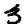  |
|   2   |    9755    |     5      |     8     |   |    8521    |     1      |     2     |   |
|   1   |    9015    |     2      |     7     |   |    6081    |     5      |     9     |   |

  

## 2. Conv2D Neural Network on CIFAR10 Dataset

### 2.1. First CNN

#### Model Summary

For the first run, we chose once again to try the model1 on the new dataset

|   ID   |  Loss  | Accuracy | Training Time |
| :----: | :----: | :------: | :-----------: |
| model1 | 2.1902 |  30.53%  |    100.20s    |

- Conv2D: 32, 3, 1, 'valid'.
- Flatten.
- Dense: 10 ('softmax').

For the first time, we obtain bad results from a model. The color images were much more complicated to analyse.

#### Loss and Accuracy Plots

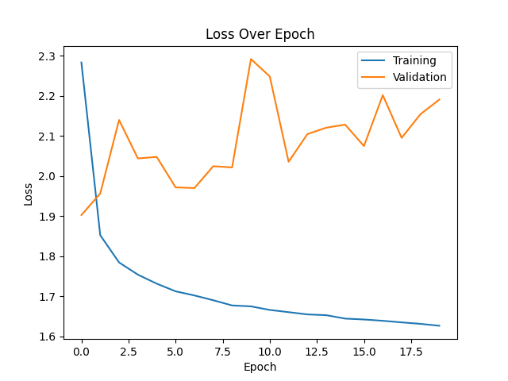
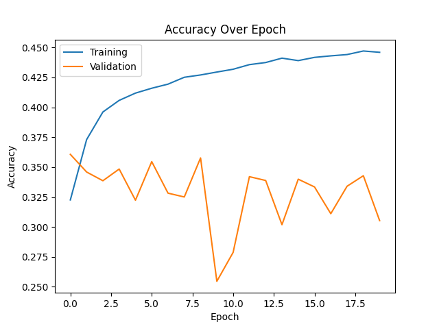

Also, the overfitting is already tremendous.

#### Confusion Matrix

To confirm everything we've seen so far, the confusion matrix shows that the predictions are very far from the actual values. We can barely distinguish the diagonal.

#### 10 Worst Classified Images

| Rank  | Image Idx. | Pred. Cat. | Act. Cat. |                       Image                       |
| :---: | :--------: | :--------: | :-------: | :-----------------------------------------------: |
|  10   |    3650    |    Ship    |   Plane   |  |
|   9   |    9590    |    Ship    |   Plane   |   |
|   8   |    2968    |    Ship    |   Plane   |   |
|   7   |    9766    |    Ship    |   Plane   |   |
|   6   |    7454    |    Ship    |   Plane   |   |
|   5   |    3278    |    Ship    |   Plane   |   |
|   4   |    4981    |   Plane    |    Car    |   |
|   3   |    1651    |    Ship    |   Plane   |   |
|   2   |    7431    |    Car     |   Truck   |   |
|   1   |    2200    |    Car     |   Plane   |   |

 

### 2.2. Model Improvement

### 2.2.1. A New Architecture

#### Model Summary

This time, the model4, one of the best models we've tested, is used.

|   ID   |  Loss  | Accuracy | Training Time |
| :----: | :----: | :------: | :-----------: |
| model4 | 1.2091 |  67.51%  |    107.47s    |

- Conv2D: 64, 3, 1, 'valid'.
- Conv2D: 32, 3, 1, 'valid'.
- Dropout.
- Activation: 'relu'.
- MaxPooling: 2, 1, 'valid'.
- Conv2D: 16, 3, 1, 'valid'.
- Flatten.
- Dense: 128, 'relu'.
- Dense: 10 ('softmax').

We might be lucky, but this model actualy improves drastically the results we've had with model1. The accuracy is already almost as good as the fourth model tested with Keras.

#### Loss and Accuracy Plots

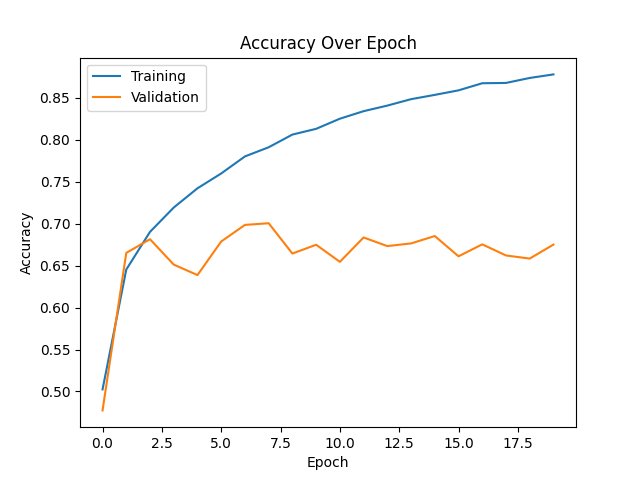

On the other hand, the overfitting is still very present, though we might have limited it.

#### Confusion Matrix

The confusion matrix also shows an important improvement as the diagonal is much more visible now.

#### 10 Worst Classified Images

| Rank  | Image Idx. | Pred. Cat. | Act. Cat. |                       Image                       |
| :---: | :--------: | :--------: | :-------: | :-----------------------------------------------: |
|  10   |    1692    |    Car     |   Truck   |  |
|   9   |    1732    |    Car     |   Truck   |   |
|   8   |    9854    |    Car     |   Truck   |   |
|   7   |    4866    |    Car     |   Truck   |   |
|   6   |    1829    |   Truck    |    Car    |   |
|   5   |    3150    |   Truck    |    Car    |   |
|   4   |    5041    |    Car     |   Truck   |   |
|   3   |    6615    |    Dog     |   Horse   |   |
|   2   |    6968    |   Plane    |   Ship    |   |
|   1   |    3812    |    Car     |   Truck   |   |

 

### 2.2.2. Going Further

#### Model Summary

Let's imagine a new model, inspired by model4, but trying to improve the final accuracy.

|   ID   |  Loss  | Accuracy | Training Time |
| :----: | :----: | :------: | :-----------: |
| model5 | 0.9670 |  70.11%  |    134.46s    |

- Conv2D: 64, 3, 1, 'valid'.
- Conv2D: 32, 3, 1, 'valid'.
- Dropout.
- Activation: 'relu'.
- MaxPooling: 2, 1, 'valid'.
- `Conv2D: 64, 3, 1, 'valid'.`
- `Conv2D: 32, 3, 1, 'valid'.`
- `Dropout.`
- `Activation: 'relu'.`
- `MaxPooling: 2, 1, 'valid'.`
- Conv2D: 16, 3, 1, 'valid'.
- Flatten.
- Dense: 128, 'relu'.
- `Dense: 256, 'relu'.`
- Dense: 10 ('softmax').

This model gives the best results for this dataset. On the other hand, the training time is starting to grow bigger.

#### Loss and Accuracy Plots

There is persistent overfitting but at this point, there is not much solution but to use data augmentation. We will try to focus on that next.

#### Confusion Matrix

The confusion matrix is not perfect but it's the best we've had on this dataset, confirming that the model is better.

#### 10 Worst Classified Images

| Rank  | Image Idx. | Pred. Cat. | Act. Cat. |                       Image                       |
| :---: | :--------: | :--------: | :-------: | :-----------------------------------------------: |
|  10   |    5918    |   Truck    |    Car    |  |
|   9   |    2322    |    Bird    |   Plane   | 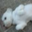  |
|   8   |    4766    |   Truck    |    Car    |   |
|   7   |    3151    |    Car     |   Ship    |   |
|   6   |     81     |   Truck    |    Car    |   |
|   5   |    6342    |   Plane    |   Ship    | 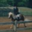  |
|   4   |    5416    |    Car     |   Truck   |   |
|   3   |    4056    |    Ship    |   Plane   |   |
|   2   |    5392    |    Car     |   Plane   |   |
|   1   |    9981    |   Horse    |   Deer    | 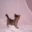  |

## 3. Data Augmentation

### Model Without Data Augmentation

We are now going to use a stable model based on `model5` that we previously saw, and matching the one we used on the Keras version. We will declare it as `PraisyNet` for no reason.

#### Model Summary

|    ID     | Data Augmentation |  Loss  | Accuracy | Training Time |
| :-------: | :---------------: | :----: | :------: | :-----------: |
| PraisyNet |        No         | 1.1851 |  69.80%  |    160.63s    |

The model architechture is the following:

- Layer1
    - Conv2d(NUM_CHANNELS, 64, 5, stride=1, padding=0)
    - Conv2d(64, 64, 5, stride=1, padding=0)
    - MaxPool2d(2, stride=2, padding=0)
    - LazyBatchNorm2d()
- Layer2
    - Conv2d(64, 128, 5, stride=1, padding=0)
    - Conv2d(128, 128, 5, stride=1, padding=0)
    - MaxPool2d(2, stride=2, padding=0)
    - LazyBatchNorm2d()
- Flatten
- Classifier
    - LazyLinear(128)
    - ReLU()
    - LazyLinear(NUM_CLASSES)

#### Loss and Accuracy Plots

As we have seen before with `model5`, there is a lot of overfitting here.

#### Confusion Matrix

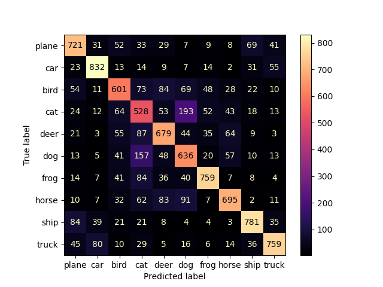

The confusion matrix is good, confirming this is a good base model.

#### 10 Worst Classified Images

| Rank  | Image Idx. | Pred. Cat. | Act. Cat. |                                Image                                 |
| :---: | :--------: | :--------: | :-------: | :------------------------------------------------------------------: |
|  10   |    8981    |    Deer    |   Horse   |  |
|   9   |    9084    |    Cat     |    Dog    |   |
|   8   |    6814    |    Car     |   Truck   |   |
|   7   |    9461    |    Frog    |   Deer    |   |
|   6   |    7929    |    Bird    |   Plane   |   |
|   5   |    4032    |    Dog     |    Cat    |   |
|   4   |    2641    |    Frog    |   Deer    |   |
|   3   |    8187    |   Horse    |    Dog    |   |
|   2   |    1631    |   Truck    |    Car    |   |
|   1   |    8808    |    Cat     |   Frog    |   |

### Model With Data Augmentation

We are now going to use a stable model based on `model5` that we previously saw, and matching the one we used on the Keras version.

#### Model Summary

|    ID     | Data Augmentation |  Loss  | Accuracy |          Training Time          |
| :-------: | :---------------: | :----: | :------: | :-----------------------------: |
| PraisyNet |        Yes        | 0.7004 |  77.18%  | 899.34s (179.87s for 20 epochs) |

The same model as before is used, and the Data Augmentation set up as the following:

- RandomAffine(0, scale=(.2, 1.2), shear=10)
- RandomHorizontalFlip()
- RandomRotation(10)

A sample of the augmented dataset images:

#### Loss and Accuracy Plots

There is clearly no overfitting anymore. The validation accuracy follows the training accuracy even up to 100 epochs.

#### Confusion Matrix

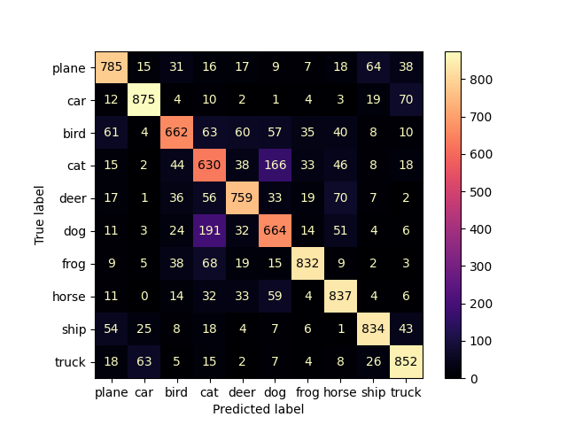

The confusion matrix is still good. So the results are not changed, the model only learns better.

#### 10 Worst Classified Images

| Rank  | Image Idx. | Pred. Cat. | Act. Cat. |                        Image                         |
| :---: | :--------: | :--------: | :-------: | :--------------------------------------------------: |
|  10   |    365     |   Plane    |   Deer    | 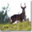 |
|   9   |    6901    |   Plane    |   Bird    |   |
|   8   |    8698    |    Deer    |   Frog    |   |
|   7   |    1118    |   Horse    |   Deer    |   |
|   6   |    8344    |    Deer    |   Horse   |   |
|   5   |    9132    |    Deer    |   Bird    |   |
|   4   |    453     |    Dog     |    Cat    | 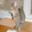  |
|   3   |    115     |   Horse    |    Cat    | 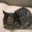  |
|   2   |    6786    |    Dog     |    Cat    |   |
|   1   |    4571    |   Horse    |   Deer    |   |

  

## 4. Transfer learning / Fine-tuning on CIFAR10 dataset

For this part, we are going to use ResNet50 pre-trained on ImageNet. 
We want to specify our input shape and remove the classifier to add our own so the model can classify 10 classes.

#### Model Summaries

Now that we know data augmentation helps improve results, we want to try fine-tuning with and without data augmentation.

|     ID     | Data Augmentation |  Loss  | Accuracy | Training time |
| :--------: | :---------------: | :----: | :------: | :-----------: |
|  MyResNet  |        No         | 1.6432 |  82.43%  |   1076.82s    |
| MyResNetDA |        Yes        | 0.8252 |  80.67%  |   1079.93s    |

 

For both MyResnet and MyResNetDA, the accuracy has increased of more than 10% compared to PraisyNet (69.80%), which is a quite good improvement (even though the training time also increased). 

 

#### Loss, Accuracy Plots and Confusion Matrices

|     ID     |                            Loss Plot                             |                            Accuracy Plot                             |                               Confusion Matrix                               |
| :--------: | :--------------------------------------------------------------: | :------------------------------------------------------------------: | :--------------------------------------------------------------------------: |
|  MyResNet  |    |  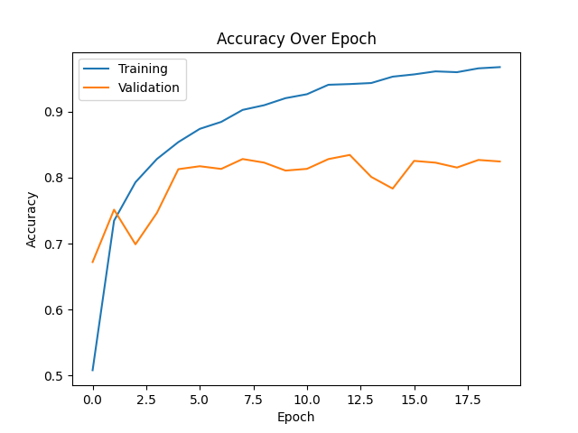  |  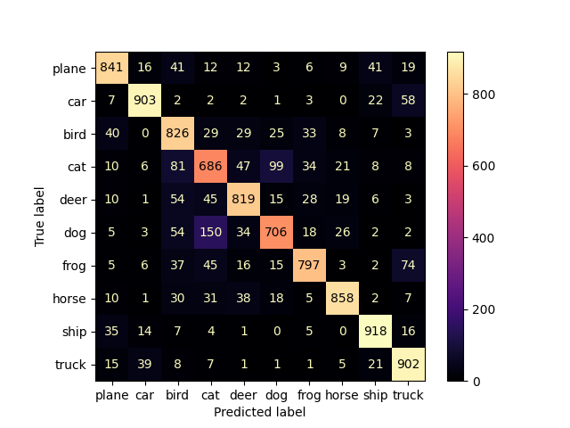  |
| MyResNetDA |  | 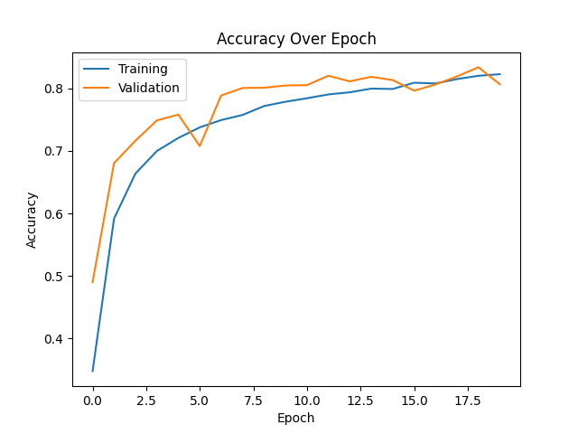 | 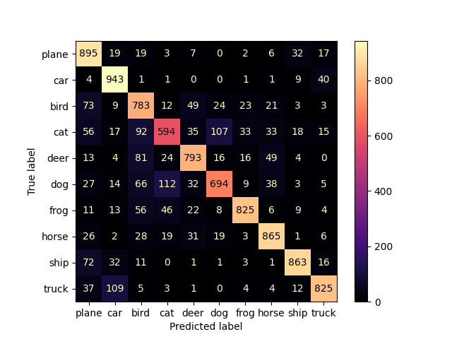 |

 

Despite better accuracies in both models, their respective plots are questionable.
Indeed, for MyResNet, the accuracy and loss plots show overfitting around the third epoch.
Fortunately (or not), we can add data augmentation in order to solve our problem. The thing is, we now observe on the accuracy plot a train accuracy that is above the test accuracy. This is a sign of underfitting, due to data augmentation. We might be adding and changing input data so much that the model become very efficient on the “simple” data in the test dataset (because it's not transformed), but still has trouble giving a good result on a lot of different data.  

 

#### 10 Worst Classified Images

|       |  MyResNet  |            |           |                                                     | MyResNetDA |            |           |                                                       |
| :---: | :--------: | :--------: | :-------: | :-------------------------------------------------: | :--------: | :--------: | :-------: | :---------------------------------------------------: |
| Rank  | Image Idx. | Pred. Cat. | Act. Cat. |                        Image                        | Image Idx. | Pred. Cat. | Act. Cat. |                         Image                         |
|  10   |    8033    |    Dog     |    Cat    |  |    9336    |    Dog     |    Cat    |  |
|   9   |    9542    |   Truck    |    Car    |   |    3390    |    Dog     |    Cat    |   |
|   8   |    345     |    Cat     |    Dog    |   |    4248    |    Dog     |    Cat    |   |
|   7   |    1731    |    Cat     |    Dog    |   |    8069    |    Bird    |   Deer    |   |
|   6   |    4930    |   Truck    |    Car    | 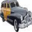  |    6383    |    Dog     |    Cat    |   |
|   5   |    5598    |   Truck    |    Car    |   |    9406    |    Cat     |    Dog    |   |
|   4   |    8549    |   Truck    |    Car    |   |    5724    |    Cat     |    Dog    |   |
|   3   |    4206    |   Truck    |    Car    |   |    6174    |    Dog     |    Cat    |   |
|   2   |    601     |    Cat     |    Dog    |   |    5237    |    Bird    |   Deer    | 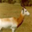  |
|   1   |    3067    |    Dog     |    Cat    |   |    6237    |    Dog     |    Cat    |   |

By analysing each ranking, we can observe that
- MyResNet tends to mistake Car as Truck (5 times), Cat as Dog (2 times) and Dog as Cat (3 times)
- MyResNetDA tends to mistake Cat as Dog (6 times) and Dog as Cat (2 times)

As mentionned earlier, since those classes are of "same type", the error is understandable.
