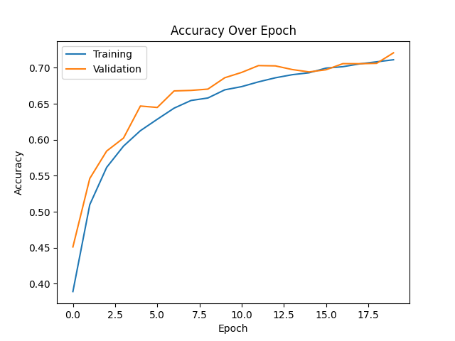
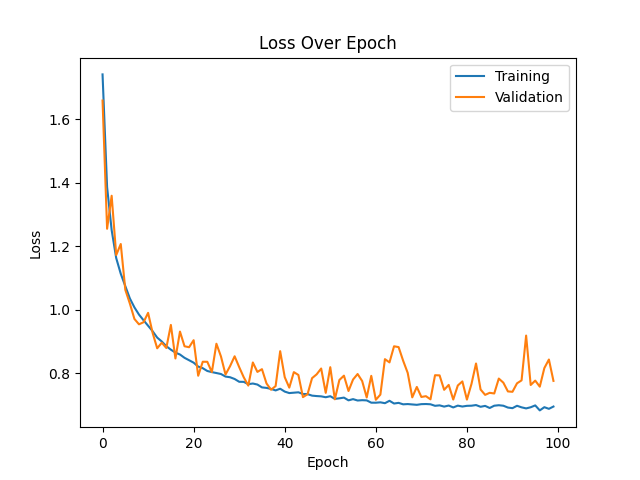
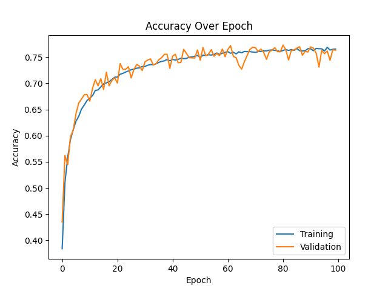
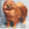
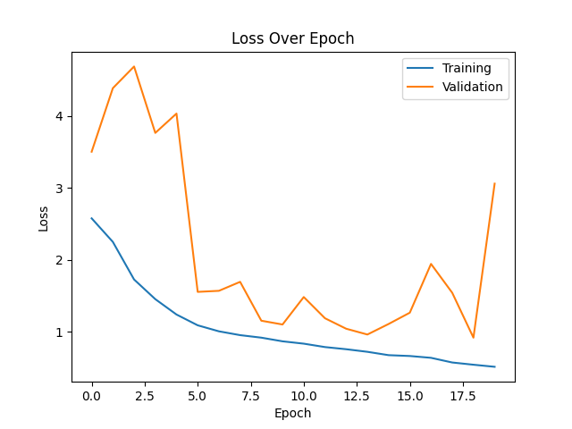
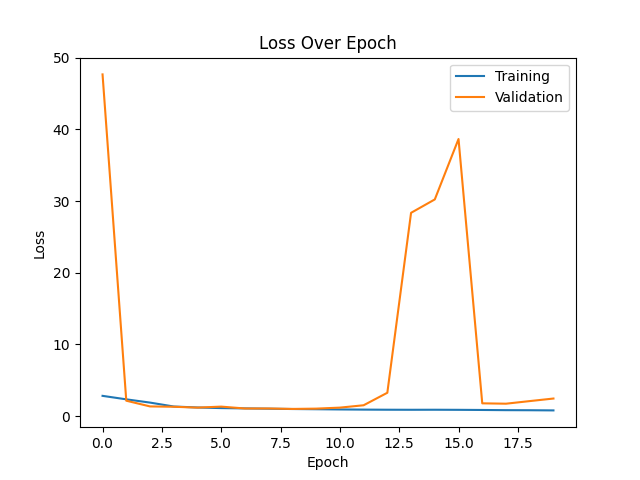

# PROVOST Iantsa & SOUCASSE Bastien — DLCV Lab 4
This a temporary file.

# Keras

## 3. Data Augmentation on CIFAR10 dataset

Our last model (model7) is the best one we could get with a CNN so far, but it shows overfitting. One way to reduce overfitting is to increase the size of the training dataset. Let's try to improve our model by doing data augmentation on our dataset.

### 3.1. Results

#### Model Summaries

All the models described below are heritated from model7, so we will only specify the parameters of the `ImageDataGenerator` in the Architecture column.

|         ID          | Architecture                                                                                                                             | Epochs |  Loss  | Accuracy |          Training time           |
| :-----------------: | :--------------------------------------------------------------------------------------------------------------------------------------- | :----: | :----: | :------: | :------------------------------: |
|       model8        | - horizontal_flip=True   - height_shift_range=0.1   - width_shift_range=0.1   - rotation_range=10   - zoom_range=0.2 |   20   | 0.9139 |  69.78%  |             340.25s              |
|       model9        | - horizontal_flip=True   - height_shift_range=0.1   - width_shift_range=0.1                                                    |   20   | 0.8267 |  72.08%  |             323.14s              |
| model10 (model9bis) | - horizontal_flip=True   - height_shift_range=0.1   - width_shift_range=0.1                                                    |  100   | 0.7761 |  76.33%  | 1557.88s (311.58s for 20 epochs) |

 

|        ID        |                                 Images                                  |
| :--------------: | :---------------------------------------------------------------------: |
|     original     |                |
|      model8      |  |
| model9 & model10 |  |

 

For model8, the parameters were chosen according to what is plausible for the subjects of our images. That's why we, for example, did not add a vertical flip (an upside down ship or truck makes no sense).
As for model9(bis), some parameters were removed as a test.
Finally, model10 is actually model9, but trained on 100 epochs.

When it comes to perfomance, the accuracy gets better as the training time goes down, which suggests that each model might be better than the previous one.
To confirm it, let's take a look at the plots.

 

#### Loss, Accuracy Plots and Confusion Matrices

|   ID    |                          Loss Plot                          |                          Accuracy Plot                          |                            Confusion Matrix                             |
| :-----: | :---------------------------------------------------------: | :-------------------------------------------------------------: | :---------------------------------------------------------------------: |
| model8  |   |   |   |
| model9  |   |   |   |
| model10 |  |  |  |

 

It was observed in the previous section (Model summaries) that our new models were providing better accuracies, but our main problem that we are trying to solve with data augmentation is overfitting. 
Looking at the model8 accuracy plot, we can see that the validation curve is above the test one. It could mean that the model is underfitting but the gap is not that big.

With model9, we managed to slightly reduce the gap a bit. Since the curves look like they keep going up, we trained it again on more epochs (model10).
Even though the test accuracy oscillates around the train accuracy, the test accuracy follows closely the train accuracy which means less/no overfitting.

 

#### 10 Worst Classified Images

|       |   model8   |            |           |            |                                                 |   model9   |            |           |            |                                                 |  model10   |            |           |            |                                                  |
| :---: | :--------: | :--------: | :-------: | :--------: | :---------------------------------------------: | :--------: | :--------: | :-------: | :--------: | :---------------------------------------------: | :--------: | :--------: | :-------: | :--------: | :----------------------------------------------: |
| Rank  | Image Idx. | Pred. Cat. | Act. Cat. | Prob. Act. |                      Image                      | Image Idx. | Pred. Cat. | Act. Cat. | Prob. Act. |                      Image                      | Image Idx. | Pred. Cat. | Act. Cat. | Prob. Act. |                      Image                       |
|  10   |    1396    |   Truck    |    Car    |   0.4971   |  |    7279    |    Cat     |    Dog    |   0.4975   |  |    6832    |   Truck    |    Car    |   0.4924   |  |
|   9   |    2063    |   Truck    |    Car    |   0.4951   |   |    6267    |    Car     |   Truck   |   0.4974   |   |    1051    |    Frog    |   Bird    |   0.4839   |   |
|   8   |    3404    |    Cat     |    Dog    |   0.4934   |   |    4005    |    Cat     |    Dog    |   0.4965   |   |    3094    |   Plane    |   Bird    |   0.4833   |   |
|   7   |    9141    |    Frog    |    Cat    |   0.4921   |   |    2964    |    Ship    |   Plane   |   0.4941   |   |    8884    |   Horse    |   Plane   |   0.4832   |   |
|   6   |    8595    |   Truck    |    Car    |   0.4904   |   |    8437    |    Deer    |   Horse   |   0.4930   |   |    2153    |   Plane    |   Ship    |   0.4783   |   |
|   5   |    9102    |    Deer    |   Horse   |   0.4885   |   |    9295    |    Dog     |    Cat    |   0.4929   |   |    5805    |   Truck    |    Car    |   0.4771   |   |
|   4   |    7384    |    Dog     |    Cat    |   0.4873   |   |    9649    |    Cat     |    Dog    |   0.4925   |   |    5240    |   Truck    |    Car    |   0.4769   |   |
|   3   |    6055    |    Ship    |   Plane   |   0.4821   |   |    6228    |   Horse    |   Deer    |   0.4904   |   |    7942    |    Car     |   Truck   |   0.4742   |   |
|   2   |    6399    |   Truck    |    Car    |   0.4803   |   |    1733    |    Dog     |    Cat    |   0.4874   |   |    5085    |    Frog    |   Bird    |   0.4732   |   |
|   1   |    4125    |   Plane    |   Ship    |   0.4783   |   |    3130    |    Dog     |    Cat    |   0.4869   |   |    4421    |    Dog     |   Bird    |   0.4692   |   |

By analysing each ranking, we can observe that
- model8 tends to mistake Car as Truck (4 times)
- model9/10 also (Car as Truck 3 times, Truck as Car 1 time), and Cat as Dog, Dog as Cat (3 times each)

These classes are respectively of the same type of subject, and kind of look alike. Therefore, they are not aberrant mistakes.

  

### 3.2. Comparison

To conclude this part, let's compare our new best model (model10) with the ones of our original model (model7) that was the base.

|   ID    |                          Accuracy Plot                          | Accuracy |          Training time           |
| :-----: | :-------------------------------------------------------------: | :------: | :------------------------------: |
| model7  |   |  68.57%  |             158.78s              |
| model10 |  |  76.33%  | 1557.88s (311.58s for 20 epochs) |

In spite of an almost twice longer training time, model10 overperforms model7. 
Indeed, model10 provides an accuracy that is almost 8% higher and the problem of overfitting seems solved
(even if the plots are not on the same number of epochs, we do not need more epochs to see that the test accuracy will not get higher in model7).

  

## 4. Transfer learning / Fine-tuning on CIFAR10 dataset

### 4.1. Results

For this part, we are going to use ResNet50 pre-trained on ImageNet. 
We want to specify our input shape and remove the classifier to add our own so the model can classify 10 classes.

#### Model Summaries

Now that we know data augmentation helps improve results, we want to try fine-tuning with and without data augmentation.

|     ID     |   Data Augmentation   |  Loss  | Accuracy | Training time |
| :--------: | :-------------------: | :----: | :------: | :-----------: |
|  MyResNet  |          No           | 3.0612 |  73.63%  |   1153.49s    |
| MyResNetDA | Yes, same than model9 | 2.4440 |  76.15%  |   1172.44s    |

 

We expected MyResNetDA to provide a higher accuracy and it did, but very slightly (+3%).
As ResNet50 has 50 layers and none of them were frozen, it is trained entirely and so the training time is quite long (about 20 minutes).

 

#### Loss, Accuracy Plots and Confusion Matrices

|     ID     |                           Loss Plot                            |                           Accuracy Plot                            |                              Confusion Matrix                              |
| :--------: | :------------------------------------------------------------: | :----------------------------------------------------------------: | :------------------------------------------------------------------------: |
|  MyResNet  |    |    |    |
| MyResNetDA |  |  |  |

 

MyResNet's accuracy plot shows overfitting, whereas data augmentation seems to do its job in MyResNetDA.
Indeed, the test accuracy seems very close to train accuracy until around the 9th epoch (we couldn't figure out the drop). Then it gets back on track towards the end.

Although both confusion matrices look OK, with the diagonal representing the true positives, we cannot say the same about loss plots.
They look abnormal, and we unfortunately could not figure out why.

After many tries, with different types of normalization and/or layer freezing, we did not manage to get interesting/better results.

 

#### 10 Worst Classified Images

|       |  MyResNet  |            |           |            |                                                   | MyResNetDA |            |           |            |                                                     |
| :---: | :--------: | :--------: | :-------: | :--------: | :-----------------------------------------------: | :--------: | :--------: | :-------: | :--------: | :-------------------------------------------------: |
| Rank  | Image Idx. | Pred. Cat. | Act. Cat. | Prob. Act. |                       Image                       | Image Idx. | Pred. Cat. | Act. Cat. | Prob. Act. |                        Image                        |
|  10   |    3029    |   Truck    |    Car    |   0.4975   |  |    1771    |    Deer    |   Bird    |   0.4934   |  |
|   9   |    7970    |    Dog     |    Cat    |   0.4925   |   |    7639    |    Car     |   Truck   |   0.4913   |   |
|   8   |    9778    |    Dog     |    Cat    |   0.4895   |   |    6581    |   Truck    |    Car    |   0.4890   |   |
|   7   |    5432    |    Ship    |   Truck   |   0.4883   |   |    7093    |    Deer    |   Bird    |   0.4852   |   |
|   6   |    778     |    Ship    |   Plane   |   0.4871   |   |    8761    |    Ship    |   Plane   |   0.4848   |   |
|   5   |    169     |    Ship    |   Plane   |   0.4856   |   |    1549    |   Truck    |    Car    |   0.4822   |   |
|   4   |    2744    |    Car     |   Truck   |   0.4838   |   |    4223    |   Plane    |   Ship    |   0.4812   |   |
|   3   |     55     |   Plane    |   Ship    |   0.4825   |   |    2809    |    Frog    |   Deer    |   0.4778   |   |
|   2   |    7605    |    Deer    |   Bird    |   0.4733   |   |    3182    |   Plane    |   Ship    |   0.4763   |   |
|   1   |    7714    |    Dog     |    Cat    |   0.4722   |   |    2879    |    Ship    |   Plane   |   0.4752   |   |

By analysing each ranking, we can observe that
- MyResNet tends to mistake Cat as Dog (3 times)
- MyResNetDA tends to mistake Ship as Truck and Truck as Ship (3 times in total)

In the same way than in the previous part about data augmentation, the mistakes done by our models are "understanble" since it confuses subjects that are of the "same type".

  

### 4.1. Comparison

To conclude this part, let's compare the model improvements (model10 and MyResNetDA), and our model from part 2 (model7).

|    ID    |                          Accuracy Plot                           | Accuracy |          Training time           |
| :------: | :--------------------------------------------------------------: | :------: | :------------------------------: |
|  model7  |    |  68.57%  |             158.78s              |
| model10  |   |  76.33%  | 1557.88s (311.58s for 20 epochs) |
| MyResNet |  |  76.15%  |             1172.44s             |

 

Our improved models (model10 and MyResNetDA) provides about the same accuracy but MyResNetDA overfits, unlike model10.
What is more, MyResNetDA is almost 4 times slower.

As a conclusion, MyResNetDA was able to improve model7 but could not compete with model10.

  
