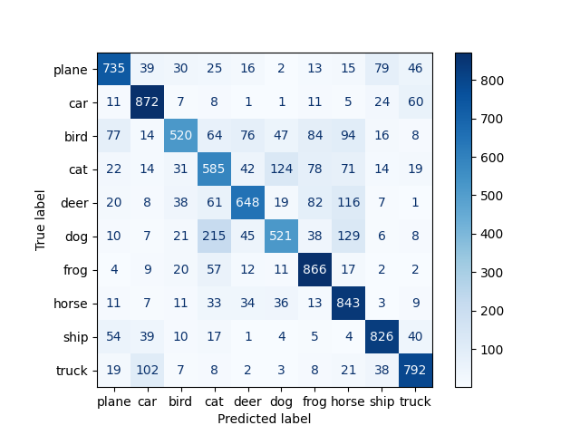

# PROVOST Iantsa & SOUCASSE Bastien — DLCV Lab 4
This a temporary file.

# Keras

## 3. Data Augmentation on CIFAR10 dataset

Our last model (model4) is the best one we could get with a CNN so far, but it shows overfitting. One way to reduce overfitting is to increase the size of the training dataset. Let's try to improve our model by doing data augmentation on our dataset.

### 3.1. Example of transformation

### 3.2. Models

 

 

 

Model8
Combinaison de tout sauf featurewise_std_normalization
20 epochs
32 batch
SUMMARY:
    - Loss: 0.8861
    - Accuracy: 0.7053
    - Training Time: 334.50s

If your model's accuracy on your testing data is lower than your training or validation accuracy, it usually indicates that there are meaningful differences between the kind of data you trained the model on and the testing data you're providing for evaluation.
De toute façon je pense pas le garder lui

Model9
Combinaison de tout sauf featurewise_std_normalization, zoom_range et rotation_range
20 epochs
32 batch
SUMMARY:
    - Loss: 0.8356
    - Accuracy: 0.7239
    - Training Time: 309.58s

Vraiment pas mal, on peut s'arrêter là.
Pratiquement plus d'overfitting + acc meilleure de 5% par rap au dernier modèle, 10% par rapport à modèle original

Model10 -> MODEL3
(Comme le 7 mais avec 100 epochs)
Combinaison de tout sauf featurewise_std_normalization, zoom_range et rotation_range
100 epochs
32 batch
SUMMARY:
    - Loss: 0.8104
    - Accuracy: 0.7499
    - Training Time: 1541.75s

----------------

Model8
10 WORST CLASSIFIED IMAGES

1.  IMAGE 4124
    - Predicted category: 1
    - Actual category: [8]

    - Probability: [0.49255937]

2. IMAGE 5065
    - Predicted category: 8
    - Actual category: [0]

    - Probability: [0.48973006]

3. IMAGE 2255
    - Predicted category: 8
    - Actual category: [1]

    - Probability: [0.48923844]

4. IMAGE 7492
    - Predicted category: 1
    - Actual category: [9]

    - Probability: [0.48619634]

5. IMAGE 6603
    - Predicted category: 1
    - Actual category: [9]

    - Probability: [0.48262691]

6. IMAGE 7028
    - Predicted category: 1
    - Actual category: [9]

    - Probability: [0.48058978]

7. IMAGE 8437
    - Predicted category: 4
    - Actual category: [7]

    - Probability: [0.47952262]

8. IMAGE 8402
    - Predicted category: 8
    - Actual category: [0]

    - Probability: [0.47926417]

9. IMAGE 6581
    - Predicted category: 9
    - Actual category: [1]

    - Probability: [0.47686422]

10. IMAGE 8820
    - Predicted category: 0
    - Actual category: [2]

    - Probability: [0.47666997]

Model10
10 WORST CLASSIFIED IMAGES

10. IMAGE 5321
    - Predicted category: 9
    - Actual category: [1]

    - Probability: [0.49963602]

9. IMAGE 1878
    - Predicted category: 1
    - Actual category: [7]

    - Probability: [0.49652457]

8. IMAGE 3393
    - Predicted category: 3
    - Actual category: [5]

    - Probability: [0.492648]

7. IMAGE 977
    - Predicted category: 0
    - Actual category: [8]

    - Probability: [0.4881265]

6. IMAGE 726
    - Predicted category: 9
    - Actual category: [1]

    - Probability: [0.48692647]

5. IMAGE 7246
    - Predicted category: 2
    - Actual category: [0]

    - Probability: [0.48616004]

4. IMAGE 3410
    - Predicted category: 7
    - Actual category: [4]

    - Probability: [0.48444542]

3. IMAGE 2624
    - Predicted category: 1
    - Actual category: [8]

    - Probability: [0.4833802]

2. IMAGE 6273
    - Predicted category: 9
    - Actual category: [1]

    - Probability: [0.48195648]

1. IMAGE 3430
    - Predicted category: 1
    - Actual category: [8]

    - Probability: [0.48186]

Model10 -> MODEL3
10 WORST CLASSIFIED IMAGES

1.  IMAGE 3882
    - Predicted category: 9
    - Actual category: [1]

    - Probability: [0.4982284]

2. IMAGE 1901
    - Predicted category: 7
    - Actual category: [5]

    - Probability: [0.496816]

3. IMAGE 9209
    - Predicted category: 1
    - Actual category: [9]

    - Probability: [0.49121827]

4. IMAGE 8866
    - Predicted category: 8
    - Actual category: [1]

    - Probability: [0.48613763]

5. IMAGE 1750
    - Predicted category: 0
    - Actual category: [8]

    - Probability: [0.48494038]

6. IMAGE 6294
    - Predicted category: 8
    - Actual category: [0]

    - Probability: [0.4845176]

7. IMAGE 3455
    - Predicted category: 3
    - Actual category: [6]

    - Probability: [0.48421583]

8. IMAGE 1262
    - Predicted category: 0
    - Actual category: [8]

    - Probability: [0.483926]

9. IMAGE 9980
    - Predicted category: 8
    - Actual category: [0]

    - Probability: [0.4837824]

10. IMAGE 5647
    - Predicted category: 3
    - Actual category: [5]

    - Probability: [0.48187375]

  

## 4. Transfer learning / Fine-tuning on CIFAR10 dataset
